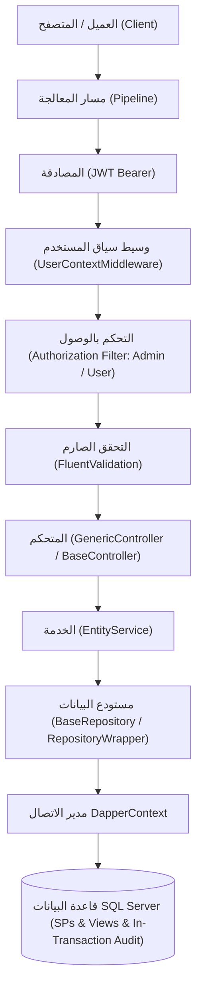

# الدليل المعماري للنظام (Architecture Guide)
### معمارية الميزات الرأسية، سجل التدقيق الذري، والتحكم بالوصول في OC_System

---

## 1. نظرة عامة على المعمارية

يعتمد المشروع نمط **Feature-Based Architecture** (المعروف أيضاً بـ **Vertical Slice Architecture**).
بدلاً من توزيع كود الميزة الواحدة عبر مجلدات عامة بعيدة عن بعضها (Controllers في مجلد منفصل، Services في مجلد آخر، إلخ)، يتم تجميع كل ما يخص الميزة الواحدة في مجلد مستقل تحت `Features/<FeatureName>/`، بما في ذلك الـ DTOs والـ Validators وسكريبتات قاعدة البيانات (Sql).



---

## 2. الهيكلية العامة للمجلدات (Folder Structure)

```text
OC_System_Training/
├── Features/                  <-- الميزات والوحدات الوظيفية المستقلة
│   ├── AuditLogs/             <-- ميزة سجل التدقيق والتتبع للمسؤول
│   │   ├── Controllers/       <-- AuditLogController [Authorize(Roles = "Admin")]
│   │   ├── Dtos/              <-- AuditLogFilter, AuditLogResponse
│   │   ├── Repositories/      <-- IAuditLogRepository, AuditLogRepository
│   │   ├── Services/          <-- IAuditLogService, AuditLogService
│   │   └── Sql/               <-- 01_AuditLogs_Tables..., 02_AuditLogs_Procedures.sql
│   ├── Auth/                  <-- ميزة المصادقة وتسجيل الدخول
│   │   ├── Controllers/       <-- AuthController
│   │   ├── Dtos/              <-- LoginRequest, LoginResponse, RegisterRequest, UserDto
│   │   ├── Repositories/      <-- IUserRepository, UserRepository
│   │   ├── Services/          <-- IAuthService, AuthService
│   │   ├── Sql/               <-- 01_Users_Tables..., 02_Users_Procedures.sql
│   │   └── Validators/        <-- LoginRequestValidator, RegisterRequestValidator
│   ├── Departments/           <-- ميزة إدارة الأقسام الدراسية
│   │   ├── Controllers/       <-- DepartmentController (CRUD + Lookup)
│   │   ├── Dtos/              <-- DepartmentForm, DepartmentUpdate, DepartmentFilter, DepartmentResponse
│   │   ├── Repositories/      <-- IDepartmentRepository, DepartmentRepository (مع دالة Lookup)
│   │   ├── Services/          <-- IDepartmentService, DepartmentService
│   │   ├── Sql/               <-- 01_Departments_Tables..., 02_Departments_Procedures.sql (DepartmentsLookup)
│   │   └── Validators/        <-- DepartmentFormValidator, DepartmentUpdateValidator
│   └── Students/              <-- ميزة إدارة الطلاب
│       ├── Controllers/       <-- StudentController
│       ├── Dtos/              <-- StudentForm, StudentUpdate, StudentFilter, StudentResponse
│       ├── Repositories/      <-- IStudentRepository, StudentRepository
│       ├── Services/          <-- IStudentService, StudentService
│       ├── Sql/               <-- 01_Students_Tables..., 02_Students_Procedures.sql
│       └── Validators/        <-- StudentFormValidator, StudentUpdateValidator, StudentFilterValidator
├── Infrastructure/            <-- البنية التحتية والوصول لقاعدة البيانات
│   ├── Middleware/            <-- UserContextMiddleware
│   └── Persistence/           <-- DapperContext, DatabaseSeeder, BaseRepository, RepositoryWrapper
│       └── Sql/               <-- 00_Base_Procedures.sql, 01_SeedData.sql
├── Shared/                    <-- المكونات والملفات الثابتة المشتركة
│   ├── Attributes/            <-- [Scoped], [Sqid], [IgnoreParameter]
│   ├── Base/                  <-- BaseController, GenericController, IBaseService, CurrentUser, dto/
│   ├── Constants/             <-- DbConstants, Messages
│   ├── Enums/                 <-- LanguageType
│   ├── Extensions/            <-- Pipeline, Security, Services, Controllers, Cors
│   └── Utils/                 <-- ErrorMessagesUtils, PasswordHasher, SqidCodec
├── tests/                     <-- حزمة الاختبارات الآلية الشاملة
│   └── OC_System_Training.Tests/  <-- اختبارات Auth, Authorization, Validation, و AuditLog
├── Documentation/             <-- أدلة التدريب والتوثيق المحدثة
├── sql/                       <-- MasterMigration.sql (سكريبت التهيئة الشامل)
├── appsettings.json           <-- إعدادات السيرفر وقاعدة البيانات المحلية ومصادقة ويندوز
└── Program.cs                 <-- نقطة البداية المبسطة
```

---

## 3. شرح الطبقات ومسؤولياتها

### A. طبقة سجل التدقيق والتتبع (Audit Log Layer)
- جدول `AuditLogs` صُمم بنمط **Append-Only** (غير قابل للتعديل أو الحذف).
- عمليات تغيير البيانات الأساسية (`INSERT`, `UPDATE`, `DELETE`) تُسجل داخل نفس الـ Stored Procedure ونفس المعاملة (In-Transaction Audit)، مما يضمن الذرية التامة (Atomicity).
- أحداث تسجيل الدخول (`LOGIN_SUCCESS` و `LOGIN_FAILED`) تُسجل عبر `AuthService` مع حظر تام لتسجيل كلمات المرور أو التوكنات.

### B. طبقة الـ Lookup والتخلص من الدوال غير المستخدمة
- تم استبدال مفهوم `NoPaged` / `GetAllNotPaged` بـ **Lookup Endpoint** مخصص للأقسام (`GET /api/department/lookup`).
- تم تطهير الـ Interfaces والـ Repositories في `RepositoryWrapper` بحيث لا يتاح أي استدعاء غير مدعوم أو غير منطقي للجدول (مثلاً: الطلاب والمستخدمون لا يملكون Lookup).

### C. طبقة التحكم بالوصول (Authorization Layer)
- اعتماد نموذجين للأدوار: `Admin` (المدير بصلاحيات كاملة تشمل الحذف وسجلات التدقيق)، و `User` (المستخدم العادي للاستعراض والإضافة والتعديل).
- التمييز الصارم بين `401 Unauthorized` للمجهول، و `403 Forbidden` لمن لا يملك رتبة الإجراء.

### D. هرم التحقق الثلاثي (Validation Pyramid)
1. **FluentValidation:** فحص بنية المدخلات والقيود الشكلية قبل الوصول للخدمة.
2. **Service Layer:** فحص قواعد العمل والتكرار عبر `IsDuplicateAsync` والتحقق من وجود القسم المرتبط.
3. **Database Constraints:** قيود `CHECK` والمفاتيح الأجنبية والفهارس المصفاة (`WHERE IsDeleted = 0`).
