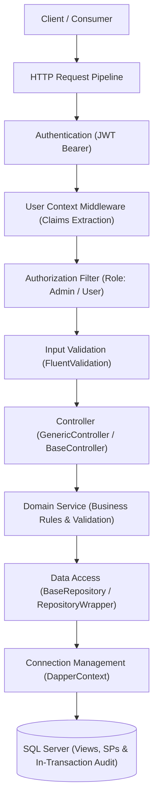

# Architecture Guide

### Vertical Slice Architecture, In-Transaction Auditing, and Clean Layered Design

---

## 1. Architectural Overview

The system implements **Vertical Slice Architecture** (also known as Feature-Based Architecture). Rather than splitting code across distant horizontal folders (placing all controllers in one folder, all services in another, etc.), every feature is self-contained under `Features/<FeatureName>/`.

A single feature folder encapsulates everything required to deliver that slice of business capability: Controllers, DTOs, Services, Repositories, Validators, and feature-specific SQL scripts.



---

## 2. Directory & Component Layout

```text
Training_Project/
├── Features/                              <-- Vertical Slice Modules
│   ├── AuditLogs/                         <-- Immutable Audit Trail Feature
│   │   ├── Controllers/                   <-- AuditLogController [Authorize(Roles = "Admin")]
│   │   ├── Dtos/                          <-- AuditLogFilter, AuditLogResponse
│   │   ├── Repositories/                  <-- IAuditLogRepository, AuditLogRepository
│   │   ├── Services/                      <-- IAuditLogService, AuditLogService
│   │   └── Sql/                           <-- Tables, indexes, and stored procedures
│   ├── Auth/                              <-- Authentication & Identity Feature
│   │   ├── Controllers/                   <-- AuthController
│   │   ├── Dtos/                          <-- LoginRequest, LoginResponse, RegisterRequest, UserDto
│   │   ├── Repositories/                  <-- IUserRepository, UserRepository
│   │   ├── Services/                      <-- IAuthService, AuthService
│   │   ├── Sql/                           <-- Users tables, constraints, indexes, SPs
│   │   └── Validators/                    <-- LoginRequestValidator, RegisterRequestValidator
│   ├── Departments/                       <-- Academic Departments Feature
│   │   ├── Controllers/                   <-- DepartmentController (CRUD + Lookup)
│   │   ├── Dtos/                          <-- DepartmentForm, DepartmentUpdate, DepartmentFilter, DepartmentResponse
│   │   ├── Repositories/                  <-- IDepartmentRepository, DepartmentRepository
│   │   ├── Services/                      <-- IDepartmentService, DepartmentService
│   │   ├── Sql/                           <-- Tables, views, and stored procedures
│   │   └── Validators/                    <-- DepartmentFormValidator, DepartmentUpdateValidator
│   └── Students/                          <-- Student Information Feature
│       ├── Controllers/                   <-- StudentController
│       ├── Dtos/                          <-- StudentForm, StudentUpdate, StudentFilter, StudentResponse
│       ├── Repositories/                  <-- IStudentRepository, StudentRepository
│       ├── Services/                      <-- IStudentService, StudentService
│       ├── Sql/                           <-- Tables, views, constraints, and stored procedures
│       └── Validators/                    <-- StudentFormValidator, StudentUpdateValidator, StudentFilterValidator
├── Infrastructure/                        <-- Shared Infrastructure & Persistence
│   ├── Middleware/                        <-- UserContextMiddleware
│   └── Persistence/                       <-- DapperContext, DatabaseSeeder, BaseRepository, RepositoryWrapper
│       └── Sql/                           <-- 00_Base_Procedures.sql, 01_SeedData.sql
├── Shared/                                <-- Shared Architectural Building Blocks
│   ├── Attributes/                        <-- [Scoped], [Transient], [Singleton], [Sqid], [IgnoreParameter]
│   ├── Base/                              <-- BaseController, GenericController, IBaseService, CurrentUser, dto/
│   ├── Constants/                         <-- DbConstants, Messages
│   ├── Enums/                             <-- LanguageType
│   ├── Extensions/                        <-- Pipeline, Security, Services, Controllers, Cors
│   └── Utils/                             <-- ErrorMessagesUtils, PasswordHasher, SqidCodec
├── tests/                                 <-- Automated Test Suite (78 Tests)
│   └── Training_Project.Tests/
├── Documentation/                         <-- Technical Architecture Guides
├── sql/                                   <-- MasterMigration.sql (Consolidated DB script)
├── appsettings.json                       <-- Configuration
└── Program.cs                             <-- Minimalist composition root
```

---

## 3. Core Architectural Layers & Responsibilities

### A. Immutable Audit Trail Layer
- The `AuditLogs` table follows an **Append-Only** pattern (no updates or deletes permitted).
- Database mutations (`INSERT`, `UPDATE`, `DELETE`) are audited within the exact same database transaction as the business operation, guaranteeing absolute atomicity.
- Authentication events (`LOGIN_SUCCESS`, `LOGIN_FAILED`) are logged via `AuthService` with sensitive credentials strictly excluded.

### B. High-Performance Stored Procedures & Views
- **Views for Queries:** All entity queries target relational views (`vw_Students`, `vw_Departments`) which join foreign keys into descriptive labels and filter soft-deleted rows (`WHERE IsDeleted = 0`).
- **Stored Procedures for Mutations:** All data modifications are executed through dedicated Stored Procedures, preventing SQL injection and maximizing query plan reuse.
- **Lookup Optimization:** Dropdown lists use optimized lookup endpoints (`GET /api/department/lookup`) rather than unbounded unpaginated queries.

### C. Role-Based Access Control (RBAC)
- Clearly separated roles: `Admin` (full administrative permissions including deletions, user provisioning, and audit logs) and `User` (standard academic registrar access).
- Strict enforcement of HTTP status codes: `401 Unauthorized` for missing/invalid authentication and `403 Forbidden` for authenticated requests lacking necessary roles.

### D. Three-Tier Defense-in-Depth Validation
1. **FluentValidation:** Validates input structure, ranges, formats, and required fields before reaching business services.
2. **Service Layer:** Enforces domain invariants, entity uniqueness via `IsDuplicateAsync`, and relational existence (e.g., verifying referenced department exists).
3. **Database Constraints:** Guarantees data integrity at rest using CHECK constraints, foreign keys, and unique filtered indexes (`WHERE IsDeleted = 0`).
