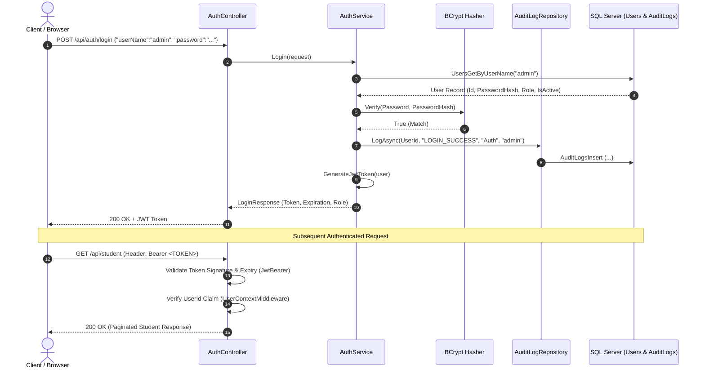

# Authentication & Identity Guide

### Session Management, JWT Tokens, BCrypt Security, and Audit Verification

---

## 1. Authentication Concept & Principles

**Authentication** is the mechanism by which the system establishes the digital identity of an incoming request, answering the fundamental question: **"Who are you?"**

### Authentication vs. Authorization:
- **Authentication ("Who are you?"):** Proving identity (e.g., submitting valid username and password credentials).
- **Authorization ("What are you allowed to do?"):** Evaluating whether the authenticated identity possesses the necessary rights to perform a specific action (e.g., can this user delete a department?).

> [!NOTE]
> A valid JWT token confirms identity; it does not grant unrestricted access to every resource. Permissions are enforced independently by authorization policies.

---

## 2. Login Flow & JWT Architecture

1. **Authentication Process:**
   - Client sends credentials (`UserName` and `Password`) to `POST /api/auth/login`.
   - The application fetches user metadata from the database via `UsersGetByUserName`.
   - Password authenticity is verified using **BCrypt** with salted comparison.
   - If valid, a cryptographically signed **JSON Web Token (JWT)** is generated and returned.
2. **JWT Anatomy:**
   - Standard 3-part structure: `Header.Payload.Signature`.
   - Signed using HMAC SHA-256 with a secure 256-bit symmetric secret key.
   - Attached to subsequent HTTP requests in the `Authorization` header:
     ```http
     Authorization: Bearer <JWT_TOKEN>
     ```

---

## 3. Claims Structure & `CurrentUser` Resolution

The JWT payload contains standardized identity claims:
- `UserId`: Numeric identifier of the user (extracted by middleware).
- `UserName`: Unique account username.
- `FullName`: Display name of the user.
- `Role`: Security role assigned to the user (`Admin` or `User`).
- `Lang`: Preferred client interface language (`en` / `ar`).

### Identity Extraction Pipeline:
1. `Microsoft.AspNetCore.Authentication.JwtBearer` validates the cryptographic signature and token expiry.
2. [`UserContextMiddleware.cs`](../Infrastructure/Middleware/UserContextMiddleware.cs) ensures the validated token contains a non-empty `UserId` claim, immediately rejecting malformed tokens with `401 Unauthorized`.
3. The scoped [`CurrentUser`](../Shared/Base/CurrentUser.cs) service resolves claims seamlessly for controllers and services without requiring direct coupling to `HttpContext`.

```csharp
public class StudentService(IRepositoryWrapper wrapper, ICurrentUser currentUser)
{
    // Access strongly-typed user claims directly
    var actingUserId = currentUser.UserId;
    var actingUserRole = currentUser.Role;
}
```

---

## 4. Inactive Account Handling & Brute-Force Defense

The `Users` table maintains an `IsActive BIT` status column:
- **Disabled Accounts (`IsActive = 0`):**
  1. `AuthService` halts authentication immediately upon discovering an inactive flag.
  2. The failure is recorded in `AuditLogs` as `LOGIN_FAILED` with reason `UserInactive`.
  3. Returns a distinct error: `UserInactive` ("User account is currently disabled.").
- **Defense Against Username Enumeration:**
  1. Incorrect passwords or non-existent usernames both return a uniform message: `InvalidCredentials` ("Invalid username or password.").
  2. Prevents malicious actors from discovering valid usernames through differential error responses.
  3. **Security Invariant:** Erroneous password attempts are never logged into `AuditLogs` to prevent accidental credential leakage.

---

## 5. End-to-End Authentication Sequence



---

## 6. Sample Request & Response Payloads

### Successful Login Request:
`POST /api/auth/login`
```json
{
  "userName": "admin",
  "password": "Admin@12345"
}
```

### Successful Login Response (200 OK):
```json
{
  "userId": "UkLWZg9D",
  "userName": "admin",
  "fullName": "System Administrator",
  "role": "Admin",
  "token": "eyJhbGciOiJIUzI1NiIsInR5cCI6IkpXVCJ9...",
  "expiresAt": "2026-10-05T12:00:00Z"
}
```

### User Identity Endpoint (Me):
`GET /api/auth/me` *(with Bearer Token header)*

**Response (200 OK):**
```json
{
  "userId": "UkLWZg9D",
  "userName": "admin",
  "fullName": "System Administrator",
  "role": "Admin",
  "lang": "en",
  "isAuthenticated": true
}
```
