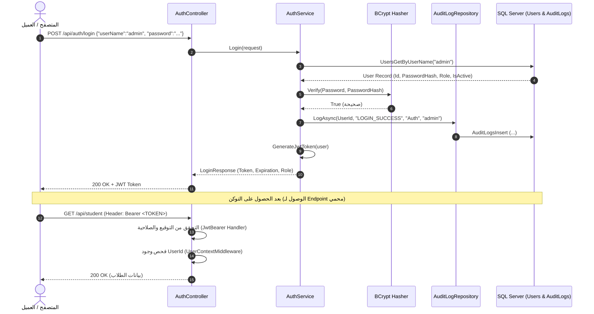

# دليل التحقق من الهوية والمصادقة (Authentication Guide)
### إدارة الجلسات، رموز JWT، التحقق من الحسابات، وتدقيق أحداث تسجيل الدخول

---

## 1. ما معنى Authentication؟
المصادقة (**Authentication**) هي العملية التي يتحقق بها النظام من هوية الطرف الذي يطلب الاتصال (سواء كان مستخدماً بشرياً أو خادماً آخر)، للإجابة على سؤال واحد فقط: **"من أنت؟"**.

### الفرق بين Authentication و Authorization:
- **Authentication (من أنت؟):** إثبات الهوية (مثل إدخال اسم المستخدم وكلمة المرور وتأكيد صحتهما).
- **Authorization (ماذا يحق لك أن تفعل؟):** التحقق من الصلاحيات الممنوحة للشخص بعد التأكد من هويته (مثل: هل يحق لهذا المستخدم حذف قسم دراسي؟).

> [!NOTE]
> امتلاك المستخدم لـ Token صحيح يعني فقط أن النظام **تعرّف عليه بنجاح**؛ ولا يعني مطلقاً أنه يملك حق تنفيذ كل عملية.

---

## 2. ما الفرق بين عملية تسجيل الدخول (Login) وتوكن الـ JWT؟

1. **عملية الـ Login:** هي مرحلة فحص بيانات الاعتماد لمرة واحدة:
   - يتلقى الخادم `UserName` و `Password`.
   - يقوم بتشفير كلمة المرور المدخلة عبر **BCrypt** ومقارنة الـ Hash بالمسجل في قاعدة البيانات.
   - إذا تطابقت، يتم إنشاء رمز مميز موقع رقمياً (**JWT Token**) يحمل بيانات المستخدم المشفرة.
2. **رمز الـ JWT (JSON Web Token):**
   - هو جواز سفر رقمي مشفر موقع بمفتاح سري (`SecretKey`).
   - يتكون من 3 أجزاء مفصولة بنقاط: `Header.Payload.Signature`
   - يتم إرساله للعميل، ويقوم العميل بإرفاقه مع كل طلب لاحق في الـ Header:
     `Authorization: Bearer <TOKEN>`

---

## 3. دور الـ Claims وكيف يعرف النظام المستخدم الحالي (`CurrentUser`)؟

الـ **Claims** هي بطاقة تعريفية مدمجة داخل الـ Payload الخاص بالتوكن. في مشروعنا التدريبي، نضمن الـ Claims التالية في كل توكن:
- `UserId`: المعرف الرقمي للمستخدم.
- `UserName`: اسم المستخدم المسجل.
- `FullName`: الاسم الكامل للمستخدم.
- `Role`: رتبة المستخدم (`Admin` أو `User`).
- `Lang`: لغة الواجهة المفضلة للمستخدم (`ar`).

### كيف يستخرج النظام هوية المستخدم؟
1. يقوم `Microsoft.AspNetCore.Authentication.JwtBearer` بالتحقق من صحة توقيع التوكن وتاريخ انتهاء صلاحيته.
2. يتولى [`UserContextMiddleware.cs`](../Infrastructure/Middleware/UserContextMiddleware.cs) التأكد من أن التوكن يحمل فعلياً معرف المستخدم `UserId`؛ فإذا كان التوكن تالفاً أو لا يحمل المعرف، يرفض الطلب فوراً بحالة `401 Unauthorized`.
3. يتوفر كائن [`CurrentUser`](../Shared/Base/CurrentUser.cs) (المحقون كـ `[Scoped]`) لأي خدمة أو متحكم عبر الواجهة `ICurrentUser`، ويتيح قراءة بيانات المستخدم الحالي بأمان دون الحاجة لتمرير `HttpContext` بين الطبقات.

```csharp
// مثال في أي مكان في الكود:
public class StudentService(IRepositoryWrapper wrapper, ICurrentUser currentUser)
{
    // currentUser.UserId -> يعطي معرف المستخدم الحالي المستخرج بأمان من التوكن
    // currentUser.Role   -> يعطي رتبة المستخدم (Admin / User)
}
```

---

## 4. التعامل مع الحسابات المعطلة ومحاولات الاختراق

في قاعدة البيانات، يحتوي جدول `Users` على عمود `IsActive BIT`.
- إذا حاول مستخدم مسجل لكن حسابه معطل (`IsActive = 0`) تسجيل الدخول:
  1. تكتشف خدمة `AuthService` أن `!user.IsActive`.
  2. يتم تسجيل محاولة الدخول الفاشلة في سجل التدقيق: `LOGIN_FAILED` مع سبب `UserInactive`.
  3. يتم إرجاع رسالة خطأ واضحة: `"حساب المستخدم معطل حالياً، يرجى مراجعة المسؤول."`
- إذا أدخل المهاجم اسم مستخدم غير موجود أو كلمة مرور خاطئة:
  1. يرجع النظام رسالة موحدة ومحايدة: `"اسم المستخدم أو كلمة المرور غير صحيحة."` لمنع هجمات حصر أسماء المستخدمين (User Enumeration Attacks).
  2. يسجل النظام في `AuditLogs` حدث `LOGIN_FAILED` مع اسم المستخدم المستهدف وحالة الفشل `IsSuccess = 0`.
  3. **قاعدة حاسمة:** لا نقوم بتسجيل كلمة المرور الخاطئة المدخلة نهائياً في سجل التدقيق؛ لأن المستخدمين كثيراً ما يخطئون بإدخال كلمات مرور حساباتهم الأخرى.

---

## 5. تسلسل الطلب العملي من تسجيل الدخول إلى Endpoint محمي



---

## 6. نماذج الاختبار الميداني للـ Authentication

### طلب تسجيل الدخول الناجح:
- **POST** `/api/auth/login`
```json
{
  "userName": "admin",
  "password": "Admin@12345"
}
```
- **الاستجابة (200 OK):**
```json
{
  "userId": "UkLWZg9D",
  "userName": "admin",
  "fullName": "مدير النظام التدريبي",
  "role": "Admin",
  "token": "eyJhbGciOiJIUzI1NiIsInR5cCI6IkpXVCJ9...",
  "expiresAt": "2026-09-30T21:00:00Z"
}
```

### استعلام بيانات الحساب الحالي (Me Endpoint):
- **GET** `/api/auth/me` (مع تمرير التوكن في الـ Header)
- **الاستجابة (200 OK):**
```json
{
  "userId": "UkLWZg9D",
  "userName": "admin",
  "fullName": "مدير النظام التدريبي",
  "role": "Admin",
  "lang": "ar",
  "isAuthenticated": true
}
```
