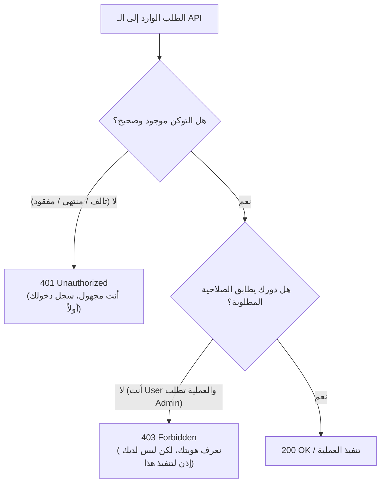

# دليل إدارة الصلاحيات والتحكم بالوصول (Authorization Guide)
### تحديد ما يُسمح للمستخدم بتنفيذه، الأدوار الأمنية، والفرق الدقيق بين 401 و 403

---

## 1. ما هو الـ Authorization ولماذا لا يكفي مجرد تسجيل الدخول؟

إذا كانت المصادقة (**Authentication**) تجيب عن سؤال: *"من أنت؟"*، فإن التفويض وإدارة الصلاحيات (**Authorization**) يجيب عن سؤال: **"هل يُسمح لك بالقيام بهذا العمل تحديداً؟"**.

### لماذا لا نكتفي بحماية الـ Endpoints بـ `[Authorize]` فقط؟
تخيل أن نظام الكلية يسمح لأي مستخدم مسجل دخول بتنفيذ أي شيء:
- يمكن لطالب أو موظف إدخال بيانات عادي أن يستدعي `DELETE /api/department/1` ويحذف قسم علوم الحاسوب بالكامل!
- يمكن لمستخدم عادي استعراض كافة حركات النظام وسجلات المراقبة في `GET /api/auditlog`!
- إخفاء زر "حذف" في تطبيق الـ Frontend **ليس حماية أمنية على الإطلاق**؛ لأن أي متدرب أو مستخدم خبيث يمكنه فتح أدوات المطور (F12) أو Postman وإرسال طلب `DELETE` مباشرة إلى الـ API.  
لذلك، **يجب أن تتم حماية الصلاحيات وفرضها بقوة داخل طبقة الـ Backend.**

---

## 2. الفرق الحاسم بين كود 401 Unauthorized وكود 403 Forbidden

كثيراً ما يخلط المطورون المبتدئون بين هذين الرمزين:



| رمز الحالة | المعنى التقني | متى يظهر في مشروعنا؟ |
|------------|--------------|-----------------------|
| **`401 Unauthorized`** | الهوية غير مثبتة أو التوكن غير صالح. | عند محاولة استدعاء أي Endpoint محمي بدون تمرير توكن JWT في الـ Header. |
| **`403 Forbidden`** | الهوية مثبتة ومعروفة، لكن لا يملك المستخدم الصلاحية الكافية. | عندما يقوم مستخدم يحمل دور `User` بمحاولة حذف طالب (`DELETE /api/student/1`) أو استعراض سجلات التدقيق (`GET /api/auditlog`). |

---

## 3. نموذج الأدوار في المشروع التدريبي (`Admin` مقابل `User`)

تجنبنا تعقيدات أنظمة الصلاحيات المؤسسية الضخمة (مثل Permissions Matrix و Dynamic Claims)، واعتمدنا نموذجاً عملياً واضحاً ومباشراً:

1. **مدير النظام (`Role = "Admin"`):**
   - إضافة وتعديل وحذف الأقسام الدراسية.
   - حذف الطلاب.
   - تسجيل مستخدمين جدد للنظام.
   - الاطلاع على سجلات التدقيق والتتبع (`AuditLogs`).
2. **المستخدم العادي (`Role = "User"`):**
   - استعراض الأقسام واستخدامها في القوائم المنسدلة (Lookup).
   - استعراض الطلاب والبحث بينهم.
   - إضافة طالب جديد وتعديل بياناته.
   - **ممنوع منعاً باتاً من الحذف، ومن تعديل الأقسام، ومن فتح سجلات التدقيق.**

---

## 4. مصفوفة الصلاحيات لكافة نقاط الاتصال (Endpoints Authorization Matrix)

| المسار (Endpoint) | الطريقة (Method) | مستوى الحماية | الصلاحية المطلوبة | السلوك عند مخالفة الصلاحية |
|-------------------|------------------|---------------|-------------------|---------------------------|
| `/api/auth/login` | `POST` | مفتوح للعموم | `[AllowAnonymous]` | - |
| `/api/auth/register` | `POST` | محمي برتبة | `[Authorize(Roles = "Admin")]` | يرجع `403 Forbidden` للمستخدم العادي |
| `/api/auth/me` | `GET` | محمي بالدخول | `[Authorize]` | يرجع `401 Unauthorized` للمجهول |
| `/api/department` | `GET` | محمي بالدخول | `[Authorize]` | متاح لكل من `Admin` و `User` |
| `/api/department/lookup` | `GET` | محمي بالدخول | `[Authorize]` | متاح لكل من `Admin` و `User` |
| `/api/department` | `POST` | محمي برتبة | `[Authorize(Roles = "Admin")]` | يرجع `403 Forbidden` للمستخدم العادي |
| `/api/department/{id}` | `PUT` | محمي برتبة | `[Authorize(Roles = "Admin")]` | يرجع `403 Forbidden` للمستخدم العادي |
| `/api/department/{id}` | `DELETE` | محمي برتبة | `[Authorize(Roles = "Admin")]` | يرجع `403 Forbidden` للمستخدم العادي |
| `/api/student` | `GET` | محمي بالدخول | `[Authorize]` | متاح للجميع بعد المصادقة |
| `/api/student` | `POST` | محمي بالدخول | `[Authorize]` | متاح لمدخلي البيانات والمدراء |
| `/api/student/{id}` | `PUT` | محمي بالدخول | `[Authorize]` | متاح لمدخلي البيانات والمدراء |
| `/api/student/{id}` | `DELETE` | محمي برتبة | `[Authorize(Roles = "Admin")]` | يرجع `403 Forbidden` للمستخدم العادي |
| `/api/auditlog` | `GET` | محمي برتبة | `[Authorize(Roles = "Admin")]` | يرجع `403 Forbidden` للمستخدم العادي |

---

## 5. تجربة عملية: كيف يختبر المتدرب رمز 403 Forbidden بنفسه؟

1. **الخطوة الأولى:** سجل الدخول بحساب مسؤول `admin` وأنشئ مستخدم عادي جديد:
   - `POST /api/auth/register`
   ```json
   {
     "fullName": "موظف التسجيل",
     "userName": "clerk",
     "password": "ClerkPassword123!",
     "role": "User"
   }
   ```
2. **الخطوة الثانية:** سجل الدخول بحساب المستخدم الجديد (`clerk`) عبر `POST /api/auth/login`، وانسخ التوكن الخاص به.
3. **الخطوة الثالثة:** في Swagger أو Scalar، ضع توكن المستخدم `clerk`، ثم حاول حذف قسم دراسي:
   - `DELETE /api/department/UkLWZg9D`
4. **النتيجة الحتمية:**
   - يرفض الـ Backend العملية فوراً ويرجع **`403 Forbidden`**.
   - لا تصل المعالجة إلى الـ Service Layer، ولا يُحذف السطر من قاعدة البيانات.
   - يثبت ذلك للمتدرب أن الـ API محمي بقوة بصرف النظر عما تظهره أو تخفيه واجهة المستخدم.
