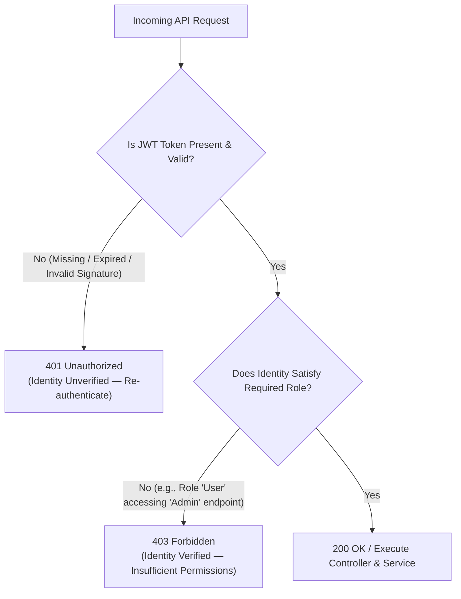

# Authorization & Access Control Guide
### Role-Based Access Control (RBAC), Endpoint Security Matrix, and Status Code Specifications (401 vs. 403)

---

## 1. Overview & Principle of Least Privilege

While **Authentication** answers the question *"Who are you?"*, **Authorization** answers the fundamental security question: **"Are you permitted to perform this specific operation?"**.

### Defense in Depth: Why Backend Enforcement is Mandatory
In modern web applications, the presentation tier (UI/Frontend) and the application tier (API/Backend) are decoupled:
- **Hiding UI Buttons is Not Security:** Suppressing an "Edit" or "Delete" button in a client application provides no actual protection. Any user can inspect network traffic, use developer tools, or invoke endpoints directly via tools like cURL or Postman.
- **Principle of Least Privilege (PoLP):** Every authenticated identity must operate with the minimum level of access required to complete their designated business functions.
- **Server-Side Enforcement:** Every HTTP request received by the API must independently validate whether the requesting security context possesses the requisite role prior to executing domain logic or database transactions.

---

## 2. Distinction: HTTP 401 Unauthorized vs. HTTP 403 Forbidden

A common architectural pitfall is conflating authentication failure with authorization failure. The system enforces strict RFC 9110 HTTP semantics:

### Comparative Specification

| Status Code | Technical Definition | Cause in Application |
|---|---|---|
| **`401 Unauthorized`** | The client request lacks valid authentication credentials for the target resource. | Invoking any protected endpoint without supplying a `Bearer <token>` in the `Authorization` header, or supplying an expired/tampered JWT. |
| **`403 Forbidden`** | The server understands the request and verified the caller's identity, but refuses to authorize execution. | An authenticated user possessing the `User` role attempting to execute administrative actions (e.g., `DELETE /api/student/{id}`, `POST /api/department`, `GET /api/auditlog`). |

---

## 3. Role-Based Access Control (RBAC) Architecture

The application adopts a clean, robust Role-Based Access Control (RBAC) model implemented via ASP.NET Core Claims and Role authorization attributes:

1. **System Administrator (`Role = "Admin"`):**
   - Full administrative lifecycle management of Academic Departments (Create, Read, Update, Delete).
   - Deletion authority for Student records (Soft Delete).
   - User account provisioning (`POST /api/auth/register`).
   - Access to system audit trails and compliance logs (`GET /api/auditlog`).

2. **Standard Operational User (`Role = "User"`):**
   - Read access to Academic Departments for dropdowns and lookup (`/api/department/lookup`, `/api/department`).
   - Querying, filtering, and retrieving student profiles.
   - Enrolling new students and updating student academic records.
   - **Explicitly Forbidden:** Deleting students, mutating department structures, registering users, and viewing system audit logs.

---

## 4. Endpoint Security & Authorization Matrix

The table below documents the security profile for every endpoint across the system:

| Route | HTTP Method | Access Level | Policy / Attribute | Unauthorized Behavior |
|---|---|---|---|---|
| `/api/auth/login` | `POST` | Public | `[AllowAnonymous]` | N/A |
| `/api/auth/register` | `POST` | Administrator | `[Authorize(Roles = "Admin")]` | Returns `403 Forbidden` for standard users |
| `/api/auth/me` | `GET` | Authenticated | `[Authorize]` | Returns `401 Unauthorized` if unauthenticated |
| `/api/department` | `GET` | Authenticated | `[Authorize]` | Accessible to `Admin` and `User` |
| `/api/department/lookup` | `GET` | Authenticated | `[Authorize]` | Accessible to `Admin` and `User` |
| `/api/department/{id}` | `GET` | Authenticated | `[Authorize]` | Accessible to `Admin` and `User` |
| `/api/department` | `POST` | Administrator | `[Authorize(Roles = "Admin")]` | Returns `403 Forbidden` for standard users |
| `/api/department/{id}` | `PUT` | Administrator | `[Authorize(Roles = "Admin")]` | Returns `403 Forbidden` for standard users |
| `/api/department/{id}` | `DELETE` | Administrator | `[Authorize(Roles = "Admin")]` | Returns `403 Forbidden` for standard users |
| `/api/student` | `GET` | Authenticated | `[Authorize]` | Accessible to `Admin` and `User` |
| `/api/student/{id}` | `GET` | Authenticated | `[Authorize]` | Accessible to `Admin` and `User` |
| `/api/student` | `POST` | Authenticated | `[Authorize]` | Accessible to `Admin` and `User` |
| `/api/student/{id}` | `PUT` | Authenticated | `[Authorize]` | Accessible to `Admin` and `User` |
| `/api/student/{id}` | `DELETE` | Administrator | `[Authorize(Roles = "Admin")]` | Returns `403 Forbidden` for standard users |
| `/api/auditlog` | `GET` | Administrator | `[Authorize(Roles = "Admin")]` | Returns `403 Forbidden` for standard users |

---

## 5. Security Verification & Role Enforcement

Security enforcement is validated through automated test suites and can be reproduced via OpenAPI / Scalar / Swagger:

### Manual Verification Workflow
1. **Provision User:** An administrator executes `POST /api/auth/register` with role `"User"`.
2. **Obtain Token:** The operational user authenticates via `POST /api/auth/login`, acquiring a standard JWT token.
3. **Attempt Elevated Action:** The user sends a `DELETE /api/department/{id}` request with their token in the `Authorization` header.
4. **Verified Result:**
   - The ASP.NET Core Authorization middleware intercepts the request prior to invoking the controller.
   - The API immediately responds with **`403 Forbidden`**.
   - Zero database mutations occur, and no service methods are triggered.
