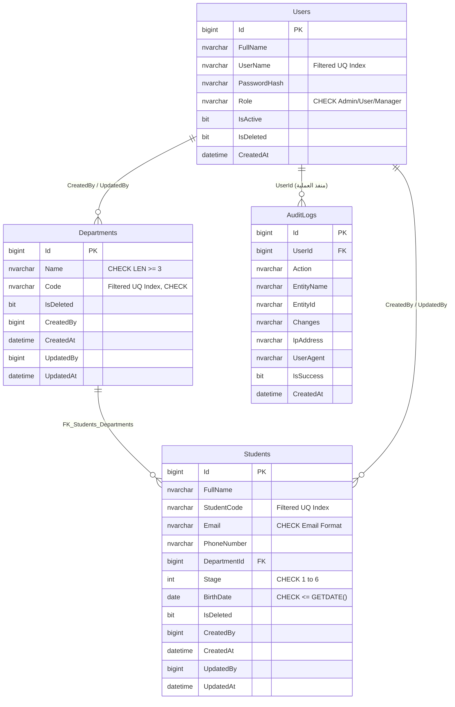

# دليل قاعدة البيانات (Database Guide)
### معمارية الميزات، تصميم الجداول، القيود، الفهارس المصفاة، الـ Views والـ Stored Procedures وسجل التدقيق

---

## 1. معمارية ملفات قاعدة البيانات (Feature-Based SQL Architecture)

تطبيقاً لمعمارية **Vertical Slice**، تم تقسيم ملفات قاعدة البيانات ووضع سكريبتات كل ميزة داخل مجلد الـ Feature المقابل، مع إبقاء الإجراءات المساعدة العامة في الـ Infrastructure:

```text
├── Infrastructure/Persistence/Sql/
│   ├── 00_Base_Procedures.sql       <-- الإجراءات المساعدة المشتركة (Base_CheckDuplicate, Base_GetFirst)
│   └── 01_SeedData.sql              <-- البيانات الأولية التجريبية (الأقسام، الطلاب، والمستخدمين)
├── Features/AuditLogs/Sql/
│   ├── 01_AuditLogs_Tables_Indexes.sql  <-- جدول سجل التدقيق والتتبع وفهارس الأداء
│   └── 02_AuditLogs_Procedures.sql      <-- إجراءات AuditLogsInsert و AuditLogsGetAll
├── Features/Auth/Sql/
│   ├── 01_Users_Tables_Constraints_Indexes.sql  <-- جدول المستخدمين والقيود وفهارس الدخول المصفاة
│   └── 02_Users_Procedures.sql                  <-- إجراءات جلب المستخدم بالاسم وإنشاء مستخدم جديد مع التدقيق
├── Features/Departments/Sql/
│   ├── 01_Departments_Tables_Views_Constraints_Indexes.sql  <-- جدول الأقسام، الـ View، والقيود والفهارس
│   └── 02_Departments_Procedures.sql                        <-- إجراءات CRUD للأقسام مع التدقيق المدمج والـ Lookup
├── Features/Students/Sql/
│   ├── 01_Students_Tables_Views_Constraints_Indexes.sql     <-- جدول الطلاب، الـ View، المفتاح الأجنبي والقيود
│   └── 02_Students_Procedures.sql                           <-- إجراءات CRUD للطلاب مع التدقيق المدمج
└── sql/
    └── MasterMigration.sql          <-- سكريبت التهيئة الشامل لكامل قاعدة البيانات بالترتيب المترابط
```

---

## 2. مخطط الكيانات والعلاقات (ERD)

قاعدة بيانات النظام التدريبي (`OC_System_Training_DB`) مبنية وفق أعلى معايير سلامة البيانات والـ Referential Integrity:



---

## 3. تفاصيل الجداول والقيود (Tables & Constraints)

### A. جدول سجل التدقيق والتتبع (`AuditLogs`)
- **Primary Key:** `PK_AuditLogs` (CLUSTERED على `Id`).
- **طبيعة السجل:** Append-Only غير قابل للتعديل أو الحذف.
- **الفهارس:**
  - `IX_AuditLogs_Entity`: فهرس على `(EntityName, EntityId)` لتسريع استخراج سجلات كيان معين.
  - `IX_AuditLogs_UserId`: فهرس على `(UserId)` لتتبع حركات مستخدم معين.
  - `IX_AuditLogs_CreatedAt`: فهرس تنازلي على `(CreatedAt DESC)` لعرض أحدث الحركات أولاً.
  - `IX_AuditLogs_Action`: فهرس على `(Action, IsSuccess)` لمراقبة محاولات الدخول الفاشلة.

### B. جدول المستخدمين (`Users`)
- **Primary Key:** `PK_Users` (CLUSTERED على `Id`).
- **CHECK Constraints:**
  - `CK_Users_Role`: التحقق من أن الدور إما `Admin` أو `User` أو `Manager`.
  - `CK_Users_UserName_Length`: ألا يقل اسم المستخدم عن 3 أحرف.

### C. جدول الأقسام الدراسية (`Departments`)
- **Primary Key:** `PK_Departments` (CLUSTERED على `Id`).
- **CHECK Constraints:**
  - `CK_Departments_Code`: ألا يقل الرمز عن حرفين وخلوه من المسافات (`Code NOT LIKE '% %'`).
  - `CK_Departments_Name`: ألا يقل اسم القسم عن 3 أحرف.

### D. جدول الطلاب (`Students`)
- **Primary Key:** `PK_Students` (CLUSTERED على `Id`).
- **Foreign Key:**
  - `FK_Students_Departments`: يربط `DepartmentId` بجدول `Departments(Id)` مع منع الحذف العشوائي (`ON DELETE NO ACTION`).
- **CHECK Constraints:**
  - `CK_Students_Stage`: المرحلة الدراسية محصورة بين 1 و 6 (`CHECK (Stage BETWEEN 1 AND 6)`).
  - `CK_Students_Email`: التحقق من سلامة صيغة البريد الإلكتروني (`CHECK (Email IS NULL OR Email LIKE '%_@__%.__%')`).
  - `CK_Students_BirthDate`: تاريخ الميلاد لا يمكن أن يكون في المستقبل (`CHECK (BirthDate IS NULL OR BirthDate <= GETDATE())`).

---

## 4. استراتيجية الفهارس المصفاة (Filtered Indexing Strategy)

في بيئات العمل التي تعتمد **الحذف المنطقي (Soft Delete)**، استخدام الـ Unique Constraints العادية يسبب مشكلة كبيرة: إذا قمت بحذف طالب بالرقم الجامعي `STU-001` منطقياً، فلن يسمح لك النظام بإعادة استخدام نفس الرقم مستقبلاً.
لذلك تم تطبيق **الفهارس الفريدة المصفاة (Unique Filtered Indexes)**:

1. **فهرس الرقم الجامعي للطلاب:**
   ```sql
   CREATE UNIQUE NONCLUSTERED INDEX UQ_Students_StudentCode_Active
   ON Students (StudentCode)
   WHERE IsDeleted = 0;
   ```
2. **فهرس رمز القسم:**
   ```sql
   CREATE UNIQUE NONCLUSTERED INDEX UQ_Departments_Code_Active
   ON Departments (Code)
   WHERE IsDeleted = 0;
   ```
3. **فهرس اسم المستخدم:**
   ```sql
   CREATE UNIQUE NONCLUSTERED INDEX UQ_Users_UserName_Active
   ON Users (UserName)
   WHERE IsDeleted = 0;
   ```

---

## 5. الـ Views المرافقة

### قواعد تصميم الـ Views في OC_System:
1. يُمنع الاستعلام المباشر من الجداول في استعلامات القراءة أو بعد عمليات الإضافة والتعديل.
2. يتم توجيه كافة عمليات القراءة إلى `vw_{TableName}`.
3. تتضمن الـ View شرط `WHERE IsDeleted = 0` لحجب البيانات المحذوفة تلقائياً.
4. تقوم الـ View بضم الجداول الخارجية لإظهار النصوص بدلاً من مجرد المعرفات الرقمية (مثل `DepartmentName` و `DepartmentCode`).

---

## 6. الإجراءات المخزنة والـ Lookup

### إجراءات الأقسام:
- `DepartmentsGetById`: جلب قسم بالمعرف.
- `DepartmentsGetAll`: استعراض الأقسام بنظام الصفحات (يرجع TotalCount ثم بيانات الصفحة).
- `DepartmentsLookup`: استرجاع سريع وموجز للأقسام (`Id, Name, Code`) للقوائم المنسدلة بدون ترقيم (بديل NotPaged).
- `DepartmentsInsert`: إدخال قسم جديد مع تسجيل التدقيق الذري `INSERT INTO AuditLogs` داخل نفس الـ Transaction.
- `DepartmentsUpdate`: تعديل قسم مع تسجيل التدقيق الذري `UPDATE`.
- `DepartmentsDelete`: حذف منطقي مع تسجيل التدقيق الذري `DELETE`.

### إجراءات الطلاب:
- `StudentsGetById`: جلب طالب بالمعرف.
- `StudentsGetAll`: بحث وترقيم الطلاب.
- `StudentsInsert`: إضافة طالب مع تسجيل التدقيق الذري `INSERT INTO AuditLogs`.
- `StudentsUpdate`: تعديل طالب مع تسجيل التدقيق الذري `UPDATE`.
- `StudentsDelete`: حذف منطقي مع تسجيل التدقيق الذري `DELETE`.
*(ملاحظة: تم حذف إجراء `StudentsGetAllNotPaged` نهائياً لعدم وجود حاجة وظيفية له في النظام التدريبي)*.

### إجراءات سجل التدقيق:
- `AuditLogsInsert`: إضافة سجل تدقيق (تستخدمها الخدمات لأحداث الدخول).
- `AuditLogsGetAll`: استعراض السجلات بنظام الصفحات مع الفلترة للمسؤول Admin.
