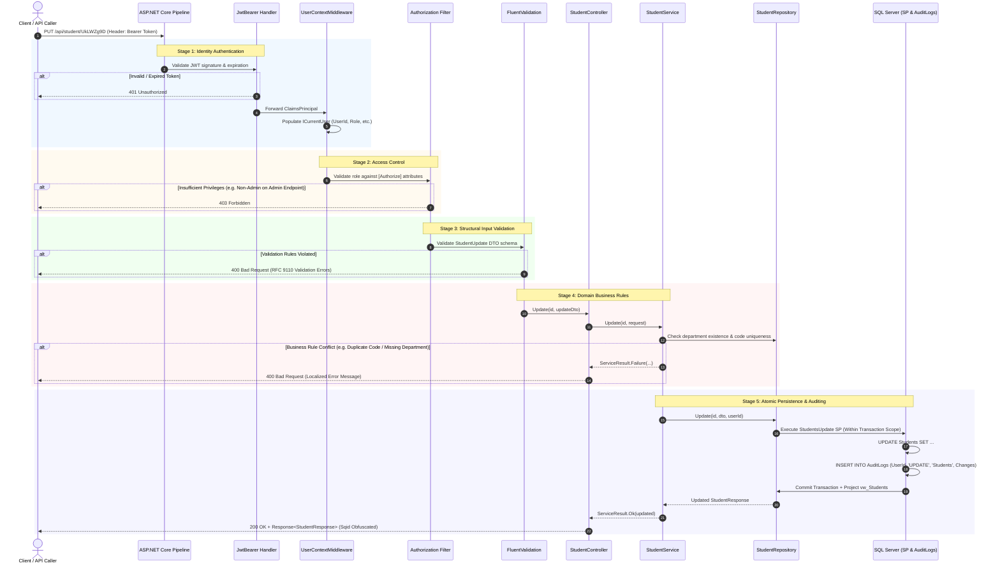

# Security Flow & Request Execution Lifecycle Guide
### End-to-End Request Pipeline from HTTP Transport to In-Transaction Audited Persistence

---

## 1. Integrated Pipeline Architecture

In this system, security features (**Authentication**, **Authorization**, **Validation**, and **Audit Logging**) operate in a cohesive, ordered pipeline. Every incoming HTTP request must pass through sequential security gates before executing domain logic or persisting changes to the database:

---

## 2. Step-by-Step Request Lifecycle

### Step 1: Route Dispatch & Sqid Model Binding
- An HTTP request arrives at `PUT /api/student/{id}`.
- The `SqidModelBinder` intercepts the route parameter, decoding the URL-safe Sqid token (e.g., `UkLWZg9D`) into the internal numeric primary key (`1`).

### Step 2: Authentication Handshake (`JwtBearer`)
- The authentication middleware parses the `Authorization: Bearer <token>` header.
- The token signature is validated against the configured symmetric signing key and issuer settings.
- If the token is missing, expired, or tampered with, the request is terminated immediately with **`401 Unauthorized`**.

### Step 3: User Context Population (`UserContextMiddleware`)
- The custom `UserContextMiddleware` extracts security claims (`UserId`, `UserName`, `Role`, `FullName`, `Lang`) from the validated `ClaimsPrincipal`.
- It populates the scoped `ICurrentUser` service, making the caller's identity transparently accessible to downstream controllers, services, and repositories.

### Step 4: Authorization & Policy Enforcement
- The ASP.NET Core authorization engine inspects attributes declared on the controller class or endpoint (e.g., `[Authorize(Roles = "Admin")]`).
- If the user's role does not satisfy the endpoint's requirements, execution halts immediately with **`403 Forbidden`**.

### Step 5: Structural Input Validation (FluentValidation)
- The automatic validation filter runs the registered `StudentUpdateValidator`.
- It verifies constraints such as mandatory fields, maximum lengths, email/phone regex patterns, and numeric ranges.
- If any validation errors exist, the pipeline halts with **`400 Bad Request`** containing the structured error breakdown.

### Step 6: Domain Rule Verification (Service Layer)
- `StudentService` receives the sanitized and authenticated request.
- The service performs domain state checks against the repository:
  1. Verifying that the target department exists and is active (`Department.Get`).
  2. Verifying that the updated student code does not conflict with another active student (`Student.IsDuplicateAsync`).
- If a rule is violated, the service yields a typed `ServiceResult<T>.Failure`, which `BaseController` maps to a clear HTTP response.

### Step 7: Atomic Database Persistence & In-Transaction Audit
- `BaseRepository` executes the compiled stored procedure (`StudentsUpdate`) within an active database transaction.
- The database engine executes:
  1. The row mutation in the domain table (`Students`).
  2. An atomic record insertion into `AuditLogs` capturing the `UserId`, action, entity, and modified field changes as JSON.
- If either operation fails, the transaction issues a complete `ROLLBACK`, guaranteeing zero data mutations without a corresponding audit trail.

### Step 8: View Projection & Response Obfuscation
- The stored procedure reads and returns the modified row directly from `vw_Students` to include joined details (such as `DepartmentName` and `DepartmentCode`).
- `GenericController` encapsulates the result inside a `Response<StudentResponse>` envelope, encoding numeric IDs back into Sqid strings for safe client consumption, and returns **`200 OK`**.

---

## 3. Response Status Code Specifications

| Scenario | HTTP Status | Expected Outcome / Error Payload |
|---|---|---|
| Request missing JWT token | `401 Unauthorized` | Request rejected before reaching controller |
| Operational user attempting admin action (e.g., student deletion) | `403 Forbidden` | Request rejected by authorization filter |
| Submitting blank student full name | `400 Bad Request` | Structured validation error dictionary |
| Submitting invalid stage value (e.g., 9) | `400 Bad Request` | Validation failure: stage must be between 1 and 6 |
| Referencing non-existent department | `400 Bad Request` | Domain failure: department does not exist |
| Assigning an already registered student code | `400 Bad Request` | Domain failure: student code already registered |
| Valid, authorized request | `200 OK` | `Response<T>` containing data and pagination metadata |
