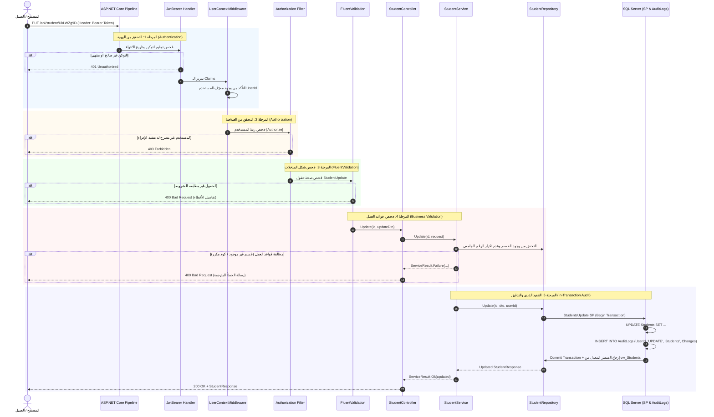

# دليل المسار الأمني والتدفق المتكامل (Security Flow Guide)
### رحلة الطلب من الوصول وحتى التسجيل في قاعدة البيانات وسجل التدقيق

---

## 1. الفلسفة المعمارية لترابط الميزات الأربع

في الأنظمة الاحترافية، لا تعمل الميزات الأربع (**Audit Log**, **Authentication**, **Authorization**, **Validation**) في جزر معزولة، بل تترابط في سلسلة معالجة متماسكة (Pipeline) تضمن أن كل طلب يمر عبر بوابات تدقيق متتالية:

---

## 2. خطوات دورة حياة الطلب خطوة بخطوة

### الخطوة 1: استقبال الطلب في الـ Pipeline
- يستقبل الخادم طلب `PUT /api/student/{id}`.
- يقوم محول الـ `SqidModelBinder` بفك تشفير المعرف المشفر في الرابط (`UkLWZg9D`) إلى المعرف الرقمي الأصلي في قاعدة البيانات (`1`).

### الخطوة 2: التحقق من الهوية (Authentication)
- يتأكد `Microsoft.AspNetCore.Authentication.JwtBearer` من أن التوكن موقع بالمفتاح السري السليم ولم تنتهِ صلاحيته.
- إذا كان التوكن مفقوداً أو غير صالح، يرفض الطلب فوراً برمز **`401 Unauthorized`**.

### الخطوة 3: سياق المستخدم (`UserContextMiddleware`)
- يفحص الوسيط وجود معرّف `UserId` داخل الـ Claims.
- يملأ كائن `ICurrentUser` الذي يصبح متاحاً لكافة الخدمات في هذا الطلب لمعرفة من هو المستخدم المنفذ.

### الخطوة 4: التحقق من الصلاحيات (Authorization)
- يفحص الـ Framework سمات الـ `[Authorize]` والـ `Roles` المحددة على دالة المتحكم.
- إذا كانت العملية تتطلب رتبة `Admin` والمستخدم يحمل رتبة `User`، يرفض الطلب فوراً برمز **`403 Forbidden`**.

### الخطوة 5: التحقق من صحة بنية المدخلات (FluentValidation)
- قبل استدعاء كود الـ Controller، يقوم `StudentUpdateValidator` بفحص الحقول:
  - الاسم الكامل ليس فارغاً ولا يتجاوز 150 حرفاً.
  - الرقم الجامعي يحمل أحرفاً وأرقاماً صحيحة.
  - المرحلة الدراسية محصورة بين 1 و 6.
  - تاريخ الميلاد ليس في المستقبل.
- إذا احتوى الطلب على أي خطأ، يرجع الخادم **`400 Bad Request`** بقائمة الحقول الخاطئة.

### الخطوة 6: فحص قواعد العمل في الخدمة (Service Layer)
- تستقبل خدمة `StudentService` الطلب الموثق والمفحوص.
- تتصل بقاعدة البيانات للتأكد من:
  1. أن القسم الدراسي المحدد موجود فعلاً في النظام وغير محذوف (`wrapper.Department.Get`).
  2. أن الرقم الجامعي الجديد غير مكرر لطالب آخر نشط (`wrapper.Student.IsDuplicateAsync`).
- إذا خالف الطلب أياً من القواعد، ترجع الخدمة خطأ عمل مفهوم (`DepartmentNotFound` أو `DuplicateStudentCode`).

### الخطوة 7: التنفيذ الذري في قاعدة البيانات (In-Transaction SP Execution)
- يفتح الـ `BaseRepository` معاملة ذرية `IDbTransaction`.
- يستدعي الإجراء المخزن `StudentsUpdate`.
- داخل نفس الإجراء وفي قلب المعاملة:
  1. يتم تحديث بيانات الطالب في جدول `Students`.
  2. يتم إدراج سطر جديد في جدول `AuditLogs` يوثق العملية:
     - `UserId`: معرف المستخدم الحالي.
     - `Action`: `'UPDATE'`.
     - `EntityName`: `'Students'`.
     - `EntityId`: معرف الطالب.
     - `Changes`: تفاصيل الحقول المعدلة بصيغة JSON.
     - `IsSuccess`: `1`.
  3. يتم تثبيت المعاملة (`Commit`).
- في حال حدث أي استثناء أو عطل مفاجئ، يتراجع النظام بالكامل (`Rollback`)، مما يمنع حدوث تعديل دون تسجيل تدقيق.

### الخطوة 8: إرجاع الاستجابة النهائية
- يُرجع الإجراء المخزن السطر المعدل مباشرة من الـ View المقابل (`vw_Students`) ليحتوي على اسم القسم المحدث وكافة التفاصيل.
- يغلف الـ `GenericController` النتيجة في كائن `Response<StudentResponse>` ويقوم بتشفير الـ IDs بصيغة Sqid قبل إرسالها للعميل مع رمز الحالة **`200 OK`**.

---

## 3. ملخص مصفوفة حالات الاستجابة للمتدربين

| الحالة | رمز الاستجابة (Status Code) | الرسالة المتوقعة للمستخدم |
|--------|----------------------------|---------------------------|
| طلب بدون توكن | `401 Unauthorized` | مجهول الهوية |
| توكن مستخدم عادي يحاول حذف طالب | `403 Forbidden` | ليس لديك صلاحية تنفيذ هذا الإجراء |
| إرسال اسم طالب فارغ | `400 Bad Request` | اسم الطالب الكامل مطلوب |
| إرسال مرحلة رقم 10 | `400 Bad Request` | المرحلة الدراسية يجب أن تكون بين 1 و 6 |
| إرسال معرف قسم غير موجود | `400 Bad Request` | القسم الدراسي المحدد غير موجود |
| إرسال رقم جامعي مسجل لطالب آخر | `400 Bad Request` | الرقم الجامعي للطالب مسجل مسبقاً لطالب آخر |
| استدعاء صحيح ومكتمل الشروط | `200 OK` | إرجاع بيانات الطالب المحدثة مع تسجيل الـ Audit Log |
