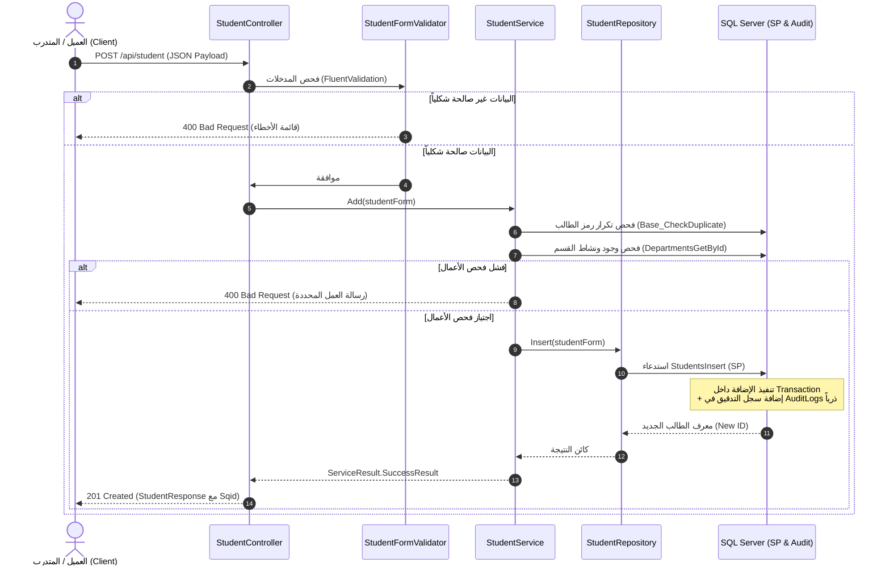

# خريطة الطريق التدريبية (Training Roadmap)
### الدليل الشامل لأولوية العمل والترتيب الصحيح لبناء Backend متكامل وفق معمارية OC_System

---

## مقدمة: فلسفة الترتيب ومفهوم شجرة الاعتماديات (Dependency Chain)

أهلاً بك في رحلتك التدريبية لبناء أنظمة الـ Backend الاحترافية.
في هذا المشروع، لن نقوم بكتابة الكود عشوائياً، ولن نبدأ بمجرد فتح ملف C# وكتابة ما يخطر في بالنا. 

المبدأ الأساسي في هندسة البرمجيات هو: **"لا يمكنك بناء سقف غرفة قبل صب أعمدتها، ولا يمكنك صب الأعمدة قبل وضع القواعد في الأرض"**.

في منظومة **OC_System**، تحكمنا قاعدة الاعتماديات الصارمة:
1. **قاعدة البيانات (Database First per Feature):** هي مصدر الحقيقة والأساس الصلب؛ لا تستطيع كتابة C# Model أو استدعاء كود حفظ لشيء غير موجود في قاعدة البيانات.
2. **عقود نقل البيانات (DTOs):** تحدد شكل البيانات الداخلة والخارجة في الذاكرة.
3. **طبقة فحص المدخلات (Validators):** تفحص شكل البيانات بمجرد دخولها وقبل أي معالجة.
4. **طبقة التخزين والاسترجاع (Repositories):** تترجم الطلبات إلى نداءات قاعدة البيانات فائقة السرعة.
5. **طبقة منطق الأعمال والخدمات (Services):** تطبق القوانين الوظيفية والتأكد من الصلاحيات والتدقيق والتكامل.
6. **واجهات الاتصال (Controllers & Middleware):** تعرض الخدمة للعالم الخارجي عبر HTTP REST APIs.

---

## القسم 1: الترتيب المنطقي الفعلي لمكونات المشروع (Actual Dependency Order)

يوضح الجدول التالي الترتيب الدقيق لما يجب تنفيذه، ولماذا، وما إذا كان يمكن تنفيذه بالتوازي:

| الترتيب | المكون (Component) | يعتمد على (Depends On) | هل يقبل التوازي؟ | لماذا هذا الترتيب تحديداً؟ |
| :--- | :--- | :--- | :--- | :--- |
| **0** | **الملفات الأساسية (Base Files & Shared)** | إطار العمل .NET | لا (جاهزة مسبقاً) | هي البنية التحتية الجاهزة؛ لا تبدأ مشروعك بإعادة كتابة العجلة بل بفهم كيفية استخدامها. |
| **1** | **جداول وسجلات التدقيق المركزية (AuditLogs & Base SQL)** | SQL Server Engine | لا | جدول `AuditLogs` يجب أن يوجد أولاً لأن الـ Stored Procedures لجميع الميزات ستسجل فيه تلقائياً داخل الترانزاكشن. |
| **2** | **جداول وقيود وفهارس الميزة (Feature Tables & Constraints)** | الجداول المشتركة والمركزية | نعم (بين الميزات المستقلة) | لضمان وجود الجداول والـ Primary Keys والـ Foreign Keys وقيود منع تكرار البيانات. |
| **3** | **واجهات العرض (Feature Views)** | جداول الميزة | لا (تعتمد على الجدول) | لأن الـ View يستعلم من الجدول الفعلي ويطبق شرط الحذف المنطقي `WHERE IsDeleted = 0` مع الـ Joins. |
| **4** | **الإجراءات المخزنة (Feature Stored Procedures)** | الجداول والـ Views وجدول التدقيق | لا | الإجراءات تُنفذ الـ CRUD وتستدعي `INSERT INTO AuditLogs`؛ لذا يجب أن تكون الجداول جاهزة. |
| **5** | **كائنات نقل البيانات (DTOs: Form, Update, Filter, Response)** | مخطط قاعدة البيانات | نعم | لأن الـ C# Code يحتاج إلى معرفة الحقول وأنواعها لتطابق أعمدة قاعدة البيانات وتلبي احتياجات واجهة المستخدم. |
| **6** | **قواعد التحقق (Validators: FluentValidation)** | كائنات الـ DTOs | نعم (بالتوازي مع Repository) | لأن الـ Validator يفحص خصائص الـ Form والـ Update مباشرة دون الحاجة للاتصال بقاعدة البيانات. |
| **7** | **المستودعات (Repositories & RepositoryWrapper)** | DapperContext, Stored Procedures, DTOs | لا | لأن الـ Repository يرسل بيانات الـ DTO إلى الـ Stored Procedure عبر مكتبة Dapper. |
| **8** | **طبقة منطق الأعمال والخدمات (Services)** | Repositories, Validators, CurrentUser | لا | لأن الـ Service هي العقل المدبر الذي ينسق بين المستودعات، ويفحص قواعد الأعمال، ويحفظ النتائج. |
| **9** | **المتحكمات وواجهات الـ API (Controllers)** | Services, Authorization Attributes | لا | لأن الـ Controller يستقبل الـ HTTP Request ويمرره للـ Service المعنية ويعيد الـ HTTP Status Code. |
| **10** | **المصادقة وحقن السياق (Auth Middleware & Tokens)** | Users Table, Jwt Settings | تطبق على مستوى النظام | لحماية الـ Endpoints وتزويد الـ Services بمعلومات المستخدم الحالي `CurrentUser`. |
| **11** | **التوثيق التفاعلي والاختبارات (Swagger, Scalar & xUnit)** | Controllers & Services جاهزة | لا (الخطوة النهائية) | لا يمكنك اختبار مسار API غير موجود؛ الاختبار يأتي للتأكد من صمود كل ما تم بناؤه. |

---

## القسم 2: خارطة الطريق التدريبية خطوة بخطوة (Step-by-Step Training Roadmap)

---

### المرحلة 0 — استكشاف البنية التحتية والملفات الثابتة (Groundwork & Base Files)

* **الهدف:**  
  أن يتعرف المتدرب على الملفات الجاهزة في المشروع والتي صُممت لتسهيل عمله بحيث **يستخدمها دون الحاجة لإعادة كتابتها**.
* **بماذا يبدأ؟**  
  قراءة دليل الملفات المشتركة ومعاينة مجلدات `Shared/` و `Infrastructure/Persistence/`.
* **ماذا ينفذ؟**  
  1. استكشاف كائن نتيجة العمليات الموحد [`ServiceResult.cs`](file:///C:/Users/husean01/RiderProjects/OC_System_Training/Shared/Base/dto/ServiceResult.cs).
  2. فهم دور كلاس سياق المستخدم الحالي [`CurrentUser.cs`](file:///C:/Users/husean01/RiderProjects/OC_System_Training/Shared/Models/CurrentUser.cs).
  3. استكشاف قاموس الرسائل الموحد باللغة العربية [`Messages.cs`](file:///C:/Users/husean01/RiderProjects/OC_System_Training/Shared/Constants/Messages.cs).
  4. استكشاف وسم الحقن التلقائي للتبعيات `[Scoped]` وكيف يغنيك عن تسجيل الخدمات يدوياً في `Program.cs`.
* **الملفات المرتبطة:**  
  - [`Shared/Base/dto/ServiceResult.cs`](file:///C:/Users/husean01/RiderProjects/OC_System_Training/Shared/Base/dto/ServiceResult.cs) (قراءة واستخدام)
  - [`Shared/Base/dto/Response.cs`](file:///C:/Users/husean01/RiderProjects/OC_System_Training/Shared/Base/dto/Response.cs) (قراءة واستخدام)
  - [`Shared/Constants/Messages.cs`](file:///C:/Users/husean01/RiderProjects/OC_System_Training/Shared/Constants/Messages.cs) (قراءة وإضافة رسائل عند الحاجة)
  - [`Shared/Constants/DbConstants.cs`](file:///C:/Users/husean01/RiderProjects/OC_System_Training/Shared/Constants/DbConstants.cs) (قراءة وإضافة أسماء الجداول)
  - [`Shared/Models/CurrentUser.cs`](file:///C:/Users/husean01/RiderProjects/OC_System_Training/Shared/Models/CurrentUser.cs) (قراءة واستخدام)
  - [`Infrastructure/Persistence/DapperContext.cs`](file:///C:/Users/husean01/RiderProjects/OC_System_Training/Infrastructure/Persistence/DapperContext.cs) (استخدام للاتصال بقاعدة البيانات)
* **لماذا الآن؟**  
  لتقليل "الحمل المعرفي"؛ المتدرب المبتدئ يصاب بالإحباط إذا شعر أنه مطالب بكتابة كل شيء من الصفر. هذه الملفات بمثابة حزمة الأدوات (Toolbox) التي سيستعملها طوال تدريبه.
* **مثال عملي:**  
  عندما تريد إرجاع نتيجة ناجحة من أي دالة في الـ Service، لا تنشئ كائناً جديداً أو `JsonResult` يدوي، بل استخدم ببساطة:
  ```csharp
  return ServiceResult<StudentResponse>.SuccessResult(studentDto);
  ```
* **متى ينتقل للمرحلة التالية؟**  
  عندما يستطيع المتدرب شرح معنى `ServiceResult`، وكيف يعرف النظام هوية المستخدم الحالي عبر `CurrentUser.UserId`.
* **أخطاء شائعة:**  
  محاولة تعديل كلاس `BaseRepository` أو إعادة كتابة كود الاتصال بقاعدة البيانات يدوياً في كل Repository بدلاً من وراثة الكلاس الأساسي.

---

### المرحلة 1 — تهيئة قاعدة البيانات وسجل التدقيق المركزي (Central DB & Audit Log Foundation)

* **الهدف:**  
  تجهيز بيئة SQL Server وإنشاء جدول سجل التدقيق `AuditLogs` والإجراءات الأساسية المشتركة، لأن كل العمليات القادمة ستعتمد عليها.
* **بماذا يبدأ؟**  
  إنشاء قاعدة بيانات فارغة باسم `OC_System_Training_DB` وتنفيذ سكريبت الجداول المركزية.
* **ماذا ينفذ؟**  
  1. تنفيذ سكريبت جدول سجل التدقيق وفهارسه [`01_AuditLogs_Tables_Indexes.sql`](file:///C:/Users/husean01/RiderProjects/OC_System_Training/Features/AuditLogs/Sql/01_AuditLogs_Tables_Indexes.sql).
  2. تنفيذ سكريبت إجراءات التدقيق [`02_AuditLogs_Procedures.sql`](file:///C:/Users/husean01/RiderProjects/OC_System_Training/Features/AuditLogs/Sql/02_AuditLogs_Procedures.sql).
  3. تنفيذ الإجراءات الأساسية المساعدة للنظام [`00_Base_Procedures.sql`](file:///C:/Users/husean01/RiderProjects/OC_System_Training/Infrastructure/Persistence/Sql/00_Base_Procedures.sql) (مثل فحص التكرار `Base_CheckDuplicate`).
  4. ضبط سلسلة الاتصال في ملف [`appsettings.json`](file:///C:/Users/husean01/RiderProjects/OC_System_Training/appsettings.json).
* **الملفات المرتبطة:**  
  - [`Features/AuditLogs/Sql/01_AuditLogs_Tables_Indexes.sql`](file:///C:/Users/husean01/RiderProjects/OC_System_Training/Features/AuditLogs/Sql/01_AuditLogs_Tables_Indexes.sql)
  - [`Features/AuditLogs/Sql/02_AuditLogs_Procedures.sql`](file:///C:/Users/husean01/RiderProjects/OC_System_Training/Features/AuditLogs/Sql/02_AuditLogs_Procedures.sql)
  - [`Infrastructure/Persistence/Sql/00_Base_Procedures.sql`](file:///C:/Users/husean01/RiderProjects/OC_System_Training/Infrastructure/Persistence/Sql/00_Base_Procedures.sql)
  - [`appsettings.json`](file:///C:/Users/husean01/RiderProjects/OC_System_Training/appsettings.json)
* **لماذا الآن؟**  
  لأننا سنبني إجراءات تخزين للطلاب والأقسام تقوم بكتابة سجل التدقيق تلقائياً داخل الترانزاكشن؛ فإذا لم يكن جدول `AuditLogs` موجوداً، ستفشل جميع الإجراءات المخزنة ولن تعمل أي عملية إضافة أو تعديل.
* **مثال عملي:**  
  فحص وجود جدول `AuditLogs` في SQL Server والتأكد من وجود الفهارس المخصصة:
  ```sql
  SELECT * FROM sys.tables WHERE name = 'AuditLogs';
  ```
* **متى ينتقل للمرحلة التالية؟**  
  عند التأكد من وجود جدول `AuditLogs`، وإجراء `AuditLogsInsert`، وإجراء `Base_CheckDuplicate` بنجاح في قاعدة البيانات.
* **أخطاء شائعة:**  
  نسيان إنشاء الفهارس المخصصة على جدول `AuditLogs` (`IX_AuditLogs_Entity`, `IX_AuditLogs_CreatedAt`)، مما يسبب بطئاً شديداً في النظام مستقبلاً عند تضخم السجلات.

---

### المرحلة 2 — منظومة المصادقة والمستخدمين (Authentication & CurrentUser)

* **الهدف:**  
  تمكين النظام من معرفة هوية الشخص الذي يرسل الطلب، وتوليد رمز JWT مشفر، وتمرير معرف المستخدم والدور إلى التطبيق تلقائياً.
* **بماذا يبدأ؟**  
  إنشاء جدول المستخدمين `Users` في قاعدة البيانات مع تشفير كلمات المرور.
* **ماذا ينفذ؟**  
  1. تنفيذ سكريبت جدول المستخدمين وقيوده [`Features/Auth/Sql/01_Users_Tables_Constraints_Indexes.sql`](file:///C:/Users/husean01/RiderProjects/OC_System_Training/Features/Auth/Sql/01_Users_Tables_Constraints_Indexes.sql).
  2. تنفيذ الإجراء المخزن للمصادقة [`02_Users_Procedures.sql`](file:///C:/Users/husean01/RiderProjects/OC_System_Training/Features/Auth/Sql/02_Users_Procedures.sql).
  3. استكشاف كلاسات DTO الخاصة بالدخول: `LoginRequest` و `LoginResponse`.
  4. استكشاف خدمة المصادقة [`AuthService.cs`](file:///C:/Users/husean01/RiderProjects/OC_System_Training/Features/Auth/Services/AuthService.cs) وفهم فحص كلمة المرور عبر `BCrypt.Verify`، والتحقق من حالة الحساب `IsActive`، وتسجيل حدث الدخول في `AuditLogs`.
  5. فهم عمل [`UserContextMiddleware.cs`](file:///C:/Users/husean01/RiderProjects/OC_System_Training/Shared/Middleware/UserContextMiddleware.cs) الذي يقرأ التوكن ويحقن `CurrentUser.UserId` و `CurrentUser.Role`.
* **الملفات المرتبطة:**  
  - [`Features/Auth/Sql/01_Users_Tables_Constraints_Indexes.sql`](file:///C:/Users/husean01/RiderProjects/OC_System_Training/Features/Auth/Sql/01_Users_Tables_Constraints_Indexes.sql)
  - [`Features/Auth/Sql/02_Users_Procedures.sql`](file:///C:/Users/husean01/RiderProjects/OC_System_Training/Features/Auth/Sql/02_Users_Procedures.sql)
  - [`Features/Auth/Dtos/LoginRequest.cs`](file:///C:/Users/husean01/RiderProjects/OC_System_Training/Features/Auth/Dtos/LoginRequest.cs)
  - [`Features/Auth/Dtos/LoginResponse.cs`](file:///C:/Users/husean01/RiderProjects/OC_System_Training/Features/Auth/Dtos/LoginResponse.cs)
  - [`Features/Auth/Services/AuthService.cs`](file:///C:/Users/husean01/RiderProjects/OC_System_Training/Features/Auth/Services/AuthService.cs)
  - [`Features/Auth/Controllers/AuthController.cs`](file:///C:/Users/husean01/RiderProjects/OC_System_Training/Features/Auth/Controllers/AuthController.cs)
  - [`Shared/Middleware/UserContextMiddleware.cs`](file:///C:/Users/husean01/RiderProjects/OC_System_Training/Shared/Middleware/UserContextMiddleware.cs)
* **لماذا الآن؟**  
  لأن كل العمليات اللاحقة (إضافة قسم، تعديل طالب، حذف سجل) تحتاج لمعرفة `UserId` لمن قام بالعملية من أجل تسجيله في الـ Audit Log، كما تحتاج لفحص صلاحية المستخدم (هل هو Admin أم User عادي؟).
* **مثال عملي:**  
  إرسال طلب `POST /api/auth/login` بالحساب الافتراضي:
  ```json
  { "userName": "admin", "password": "Admin@123456" }
  ```
  واستلام الـ JWT Token والتأكد من احتوائه على الـ Claims المطلوبة (`NameIdentifier` و `Role`).
* **متى ينتقل للمرحلة التالية؟**  
  عند تشغيل التطبيق وتسجيل الدخول بنجاح والحصول على توكن صالح، والتأكد من تسجيل حركة الدخول في جدول `AuditLogs`.
* **أخطاء شائعة:**  
  حفظ كلمة المرور كنص عادي (Plain Text) في قاعدة البيانات بدلاً من استخدام التشفير القوي بـ BCrypt، أو توليد التوكن لحساب معطل (`IsActive = 0`).

---

### المرحلة 3 — ميزة الأقسام (Department Feature) — الكيان المرجعي الأول وتطبيق Lookup

* **الهدف:**  
  بناء أول ميزة كاملة تتبع معمارية النظام، وتطبيق دالة الـ `Lookup` المخصصة للقوائم المنسدلة، وحماية عمليات التعديل للمشرف فقط.
* **بماذا يبدأ؟**  
  كتابة سكريبت جدول الأقسام `Departments` مع قيد عدم تكرار الرمز والـ View الخاص به.
* **ماذا ينفذ؟**  
  1. تنفيذ سكريبت جدول وفهارس و View الأقسام [`Features/Departments/Sql/01_Departments_Tables_Views_Constraints_Indexes.sql`](file:///C:/Users/husean01/RiderProjects/OC_System_Training/Features/Departments/Sql/01_Departments_Tables_Views_Constraints_Indexes.sql).
  2. تنفيذ الإجراءات المخزنة للأقسام [`02_Departments_Procedures.sql`](file:///C:/Users/husean01/RiderProjects/OC_System_Training/Features/Departments/Sql/02_Departments_Procedures.sql) مع دمج التسجيل الذري للـ Audit Log وتوفير إجراء `DepartmentsLookup`.
  3. إنشاء كلاسات الـ DTO: `DepartmentForm`, `DepartmentUpdate`, `DepartmentFilter`, `DepartmentResponse`.
  4. إنشاء كلاسات الـ Validation عبر FluentValidation: `DepartmentFormValidator`, `DepartmentUpdateValidator`.
  5. إنشاء المستودع [`IDepartmentRepository`](file:///C:/Users/husean01/RiderProjects/OC_System_Training/Features/Departments/Repositories/IDepartmentRepository.cs) و [`DepartmentRepository`](file:///C:/Users/husean01/RiderProjects/OC_System_Training/Features/Departments/Repositories/DepartmentRepository.cs) مع دالة `Lookup()`.
  6. تسجيل المستودع في `IRepositoryWrapper` و `RepositoryWrapper`.
  7. إنشاء الخدمة [`DepartmentService`](file:///C:/Users/husean01/RiderProjects/OC_System_Training/Features/Departments/Services/DepartmentService.cs) مع فحص عدم تكرار الرمز عبر `Base_CheckDuplicate`.
  8. إنشاء المتحكم [`DepartmentController`](file:///C:/Users/husean01/RiderProjects/OC_System_Training/Features/Departments/Controllers/DepartmentController.cs) مع إتاحة `GET /lookup` و `GET` للجميع وحماية الـ `POST`, `PUT`, `DELETE` بـ `[Authorize(Roles = "Admin")]`.
* **الملفات المرتبطة:**  
  - مجلد [`Features/Departments/Sql/`](file:///C:/Users/husean01/RiderProjects/OC_System_Training/Features/Departments/Sql/)
  - مجلد [`Features/Departments/Dtos/`](file:///C:/Users/husean01/RiderProjects/OC_System_Training/Features/Departments/Dtos/)
  - مجلد [`Features/Departments/Validators/`](file:///C:/Users/husean01/RiderProjects/OC_System_Training/Features/Departments/Validators/)
  - مجلد [`Features/Departments/Repositories/`](file:///C:/Users/husean01/RiderProjects/OC_System_Training/Features/Departments/Repositories/)
  - مجلد [`Features/Departments/Services/`](file:///C:/Users/husean01/RiderProjects/OC_System_Training/Features/Departments/Services/)
  - ملف [`DepartmentController.cs`](file:///C:/Users/husean01/RiderProjects/OC_System_Training/Features/Departments/Controllers/DepartmentController.cs)
* **لماذا الآن؟**  
  لأن جدول الطلاب يعتمد بشكل مباشر على وجود الأقسام كعلاقة أساسية (`DepartmentId FOREIGN KEY`). لا يمكنك تسجيل طالب في قسم غير موجود!
* **مثال عملي:**  
  استدعاء `GET /api/department/lookup` للتأكد من أنها تعيد مصفوفة خفيفة بالأقسام النشطة فقط لملء القائمة المنسدلة في الفرونت إند.
* **متى ينتقل للمرحلة التالية؟**  
  عند القدرة على إضافة وتعديل واستعراض الأقسام، واستدعاء نقطة الـ Lookup بنجاح، وملاحظة إضافة سجل تدقيق تلقائي في جدول `AuditLogs`.
* **أخطاء شائعة:**  
  استخدام مصطلح `GetAllNotPaged` أو `NoPaged` القديم، أو نسيان وسم عمليات الحذف والإضافة بـ `[Authorize(Roles = "Admin")]` مما يتيح لأي مستخدم عادي تخريب الأقسام.

---

### المرحلة 4 — ميزة الطلاب (Student Feature) — هرم التحقق وتكامل العلاقات

* **الهدف:**  
  بناء الكيان التشغيلي الأهم في المشروع، وتطبيق هرم التحقق الثلاثي (3-Tier Validation Pyramid) مع فحص العلاقات وقواعد الأعمال.
* **بماذا يبدأ؟**  
  إنشاء جدول الطلاب `Students` مع المفتاح الأجنبي المرتبط بالأقسام والقيود المنطقية والفهارس الفريدة المصفاة.
* **ماذا ينفذ؟**  
  1. تنفيذ سكريبت الطلاب [`Features/Students/Sql/01_Students_Tables_Views_Constraints_Indexes.sql`](file:///C:/Users/husean01/RiderProjects/OC_System_Training/Features/Students/Sql/01_Students_Tables_Views_Constraints_Indexes.sql).
  2. تنفيذ الإجراءات المخزنة للطلاب [`02_Students_Procedures.sql`](file:///C:/Users/husean01/RiderProjects/OC_System_Training/Features/Students/Sql/02_Students_Procedures.sql) مع التسجيل الذري للتدقيق.
  3. إنشاء كلاسات الـ DTO: `StudentForm`, `StudentUpdate`, `StudentFilter`, `StudentResponse`.
  4. تطبيق **الطبقة الأولى من التحقق (FluentValidation)** في `StudentFormValidator` (فحص الأنماط Regex، الحدود العمرية، الحقول المطلوبة).
  5. إنشاء المستودع [`IStudentRepository`](file:///C:/Users/husean01/RiderProjects/OC_System_Training/Features/Students/Repositories/IStudentRepository.cs) و [`StudentRepository`](file:///C:/Users/husean01/RiderProjects/OC_System_Training/Features/Students/Repositories/StudentRepository.cs) (بدون دالة Lookup لأن الطلاب لا يحتاجون لقائمة منسدلة).
  6. تطبيق **الطبقة الثانية من التحقق (Service Layer Business Rules)** في [`StudentService.cs`](file:///C:/Users/husean01/RiderProjects/OC_System_Training/Features/Students/Services/StudentService.cs):
     - التأكد من أن القسم المختار موجود ونشط فعلياً.
     - التأكد من عدم تكرار رمز الطالب عبر `Base_CheckDuplicate`.
  7. إنشاء المتحكم [`StudentController`](file:///C:/Users/husean01/RiderProjects/OC_System_Training/Features/Students/Controllers/StudentController.cs) مع قصر عملية الحذف على المشرف فقط `[Authorize(Roles = "Admin")]`.
* **الملفات المرتبطة:**  
  - مجلد [`Features/Students/Sql/`](file:///C:/Users/husean01/RiderProjects/OC_System_Training/Features/Students/Sql/)
  - مجلد [`Features/Students/Dtos/`](file:///C:/Users/husean01/RiderProjects/OC_System_Training/Features/Students/Dtos/)
  - مجلد [`Features/Students/Validators/`](file:///C:/Users/husean01/RiderProjects/OC_System_Training/Features/Students/Validators/)
  - مجلد [`Features/Students/Repositories/`](file:///C:/Users/husean01/RiderProjects/OC_System_Training/Features/Students/Repositories/)
  - مجلد [`Features/Students/Services/`](file:///C:/Users/husean01/RiderProjects/OC_System_Training/Features/Students/Services/)
  - ملف [`StudentController.cs`](file:///C:/Users/husean01/RiderProjects/OC_System_Training/Features/Students/Controllers/StudentController.cs)
* **لماذا الآن؟**  
  لأن الطلاب يمثلون الميزة المعقدة التي تجمع كل ما تم تعلمه سابقاً: علاقة بكيان آخر (الأقسام)، استخدام هرم التحقق الثلاثي، والتحكم بالصلاحيات.
* **مثال عملي:**  
  محاولة إرسال طالب بـ `stage: 9` (يتم صده بـ 400 من FluentValidation)، أو إرسال طالب بقسم رقم `99999` (يتم صده بـ 400 من Service Layer).
* **متى ينتقل للمرحلة التالية؟**  
  عند نجاح إضافة طالب، واستعراض قائمة الطلاب مقسمة إلى صفحات (Paged)، والتأكد من أن كود التشفير `Sqid` يظهر في حقل المعرف `id`.
* **أخطاء شائعة:**  
  إضافة دالة `Lookup` في مستودع الطلاب، فالطالب كيان رئيسي لا يُعرض كقائمة منسدلة خفيفة، وإضافتها تنتهك مبدأ العزل المعماري.

---

### المرحلة 5 — استعراض سجلات التدقيق (Audit Logs Feature) للمشرف

* **الهدف:**  
  تمكين إدارة النظام والمشرفين من متابعة وتدقيق كل ما حدث في النظام عبر واجهة برمجية آمنة وغير قابلة للتلاعب (Read-Only & Append-Only).
* **بماذا يبدأ؟**  
  فحص البيانات التي تجمعت في جدول `AuditLogs` جراء عمليات الإضافة والتعديل في المراحل السابقة.
* **ماذا ينفذ؟**  
  1. إنشاء كلاسات الـ DTO الخاصة بالتدقيق: `AuditLogFilter` و `AuditLogResponse`.
  2. إنشاء المستودع [`IAuditLogRepository`](file:///C:/Users/husean01/RiderProjects/OC_System_Training/Features/AuditLogs/Repositories/IAuditLogRepository.cs) و [`AuditLogRepository`](file:///C:/Users/husean01/RiderProjects/OC_System_Training/Features/AuditLogs/Repositories/AuditLogRepository.cs).
  3. إنشاء الخدمة [`IAuditLogService`](file:///C:/Users/husean01/RiderProjects/OC_System_Training/Features/AuditLogs/Services/IAuditLogService.cs) و [`AuditLogService`](file:///C:/Users/husean01/RiderProjects/OC_System_Training/Features/AuditLogs/Services/AuditLogService.cs).
  4. إنشاء المتحكم [`AuditLogController`](file:///C:/Users/husean01/RiderProjects/OC_System_Training/Features/AuditLogs/Controllers/AuditLogController.cs) محمي بالكامل برتبة المشرف: `[Authorize(Roles = "Admin")]`.
  5. التأكيد الصارم على **عدم وجود أي دالة لتعديل (PUT) أو حذف (DELETE) سجلات التدقيق نهائياً** لا في الـ Controller ولا في الـ Repository.
* **الملفات المرتبطة:**  
  - مجلد [`Features/AuditLogs/Dtos/`](file:///C:/Users/husean01/RiderProjects/OC_System_Training/Features/AuditLogs/Dtos/)
  - مجلد [`Features/AuditLogs/Repositories/`](file:///C:/Users/husean01/RiderProjects/OC_System_Training/Features/AuditLogs/Repositories/)
  - مجلد [`Features/AuditLogs/Services/`](file:///C:/Users/husean01/RiderProjects/OC_System_Training/Features/AuditLogs/Services/)
  - ملف [`AuditLogController.cs`](file:///C:/Users/husean01/RiderProjects/OC_System_Training/Features/AuditLogs/Controllers/AuditLogController.cs)
* **لماذا الآن؟**  
  لأن سجل التدقيق لن يكون له معنى أو قيمة إذا بنينا واجهته قبل أن تكون هناك بيانات فعلية وحركات CRUD تجري داخل النظام.
* **مثال عملي:**  
  استدعاء `GET /api/audit-logs?entityName=Student` لمشاهدة تفاصيل الطالب الذي تم إضافته ومعرفة من أضافه ومتى والـ IP الخاص به.
* **متى ينتقل للمرحلة التالية؟**  
  عندما يستطيع المشرف استعراض السجلات مع الفلترة حسب الكيان والترقيم بالصفحات، وتأكيد حجب المسار عن المستخدم العادي بـ `403 Forbidden`.
* **أخطاء شائعة:**  
  إضافة دوال `Update` أو `Delete` في الـ Controller أو السماح لموظف الإدخال العادي باستعراض السجلات.

---

### المرحلة 6 — التوثيق التفاعلي وفحص الصلاحيات (Swagger & Scalar UI)

* **الهدف:**  
  تشغيل بيئة التوثيق والاختبار التفاعلية واختبار سيناريوهات الأمان الحقيقية بصرياً قبل الانتقال لكتابة الكود الآلي.
* **بماذا يبدأ؟**  
  تشغيل التطبيق وفتح المتصفح على رابط `/swagger` أو `/scalar/v1`.
* **ماذا ينفذ؟**  
  1. التحقق من ظهور كافة المسارات مصنفة حسب الـ Tags (`Auth`, `Departments`, `Students`, `AuditLogs`).
  2. فحص زر المصادقة **Authorize** وإدخال التوكن مع بادئة `Bearer `.
  3. تنفيذ السيناريوهات الثلاثة للصلاحيات:
     - **بدون توكن:** طلب مسار محمي وملاحظة كود `401 Unauthorized`.
     - **توكن مستخدم عادي (User):** محاولة حذف قسم وملاحظة كود `403 Forbidden`.
     - **توكن المشرف (Admin):** تنفيذ الحذف ومشاهدة نجاح العملية بكود `200 OK`.
* **الملفات المرتبطة:**  
  - [`Program.cs`](file:///C:/Users/husean01/RiderProjects/OC_System_Training/Program.cs)
  - [`appsettings.json`](file:///C:/Users/husean01/RiderProjects/OC_System_Training/appsettings.json)
  - [`Documentation/API-Testing-Guide.md`](file:///C:/Users/husean01/RiderProjects/OC_System_Training/Documentation/API-Testing-Guide.md)
* **لماذا الآن؟**  
  لأن المتدرب يحتاج إلى لمس نتائج عمله بيده والتأكد من أن كل الـ Endpoints تستجيب بصورة متوقعة قبل أتمتة الاختبارات.
* **مثال عملي:**  
  تجربة إرسال طلب استعلام للطلاب مع ترقيم الصفحات `GET /api/student?PageNumber=1&PageSize=10` وفحص الناتج.
* **متى ينتقل للمرحلة التالية؟**  
  عند نجاح جميع استدعاءات Swagger والتأكد التام من استجابة الـ APIs وفق المتوقع.
* **أخطاء شائعة:**  
  نسيان كتابة كلمة `Bearer ` قبل التوكن في نافذة Authorize في Swagger، مما يجعل السيرفر يرفض الطلب بـ 401 ويعتقد المتدرب أن هناك خطأ في الكود.

---

### المرحلة 7 — الاختبارات الآلية الشاملة (Automated Unit & Integration Tests)

* **الهدف:**  
  أتمتة الفحص والتأكد من صمود المعمارية والأمان وحماية النظام من أي أخطاء تراجعية (Regression) مستقبلاً.
* **بماذا يبدأ؟**  
  فتح مشروع الاختبارات التابع [`tests/OC_System_Training.Tests`](file:///C:/Users/husean01/RiderProjects/OC_System_Training/tests/OC_System_Training.Tests).
* **ماذا ينفذ؟**  
  1. استعراض وفهم اختبارات المصادقة [`AuthenticationTests.cs`](file:///C:/Users/husean01/RiderProjects/OC_System_Training/tests/OC_System_Training.Tests/AuthenticationTests.cs).
  2. استعراض وفهم اختبارات الصلاحيات وفصل الـ 401 والـ 403 [`AuthorizationTests.cs`](file:///C:/Users/husean01/RiderProjects/OC_System_Training/tests/OC_System_Training.Tests/AuthorizationTests.cs).
  3. استعراض وفهم اختبارات هرم التحقق [`ValidationTests.cs`](file:///C:/Users/husean01/RiderProjects/OC_System_Training/tests/OC_System_Training.Tests/ValidationTests.cs).
  4. استعراض وفهم اختبارات عدم قابلية تعديل التدقيق [`AuditLogTests.cs`](file:///C:/Users/husean01/RiderProjects/OC_System_Training/tests/OC_System_Training.Tests/AuditLogTests.cs).
  5. تشغيل أمر الاختبارات عبر الـ Terminal:
     ```powershell
     dotnet test
     ```
* **الملفات المرتبطة:**  
  - [`tests/OC_System_Training.Tests/AuthenticationTests.cs`](file:///C:/Users/husean01/RiderProjects/OC_System_Training/tests/OC_System_Training.Tests/AuthenticationTests.cs)
  - [`tests/OC_System_Training.Tests/AuthorizationTests.cs`](file:///C:/Users/husean01/RiderProjects/OC_System_Training/tests/OC_System_Training.Tests/AuthorizationTests.cs)
  - [`tests/OC_System_Training.Tests/ValidationTests.cs`](file:///C:/Users/husean01/RiderProjects/OC_System_Training/tests/OC_System_Training.Tests/ValidationTests.cs)
  - [`tests/OC_System_Training.Tests/AuditLogTests.cs`](file:///C:/Users/husean01/RiderProjects/OC_System_Training/tests/OC_System_Training.Tests/AuditLogTests.cs)
* **لماذا الآن؟**  
  لأن الاختبار الآلي لا يُكتب إلا لميزات موجودة ومحددة السلوك؛ وهو شهادة التخرج التي تثبت أن الكود يعمل بنسبة 100%.
* **مثال عملي:**  
  تشغيل الاختبارات وملاحظة النتيجة: `Passed! - Failed: 0, Passed: 19`.
* **متى ينتقل للمرحلة التالية؟**  
  ظهور اللون الأخضر لكافة الاختبارات الـ 19 دون أي فشل.
* **أخطاء شائعة:**  
  تعديل كود الاختبار ليناسب الخطأ البرمجي بدلاً من تصحيح الكود البرمجي نفسه!

---

## القسم 3: الفرق بين ترتيب التعلم وترتيب التنفيذ (Cognitive Load Reduction)

من أكبر أخطاء التدريب البرمجي أن نطلب من المتدرب قراءة وفهم كل سطر في المشروع قبل أن يبدأ العمل. هذا يسبب تشتتاً ذهنياً وانخفاضاً في الحماس.

```mermaid
flowchart LR
    subgraph S1["ما يجب أن يفهمه أولاً (Core Concepts)"]
        direction TB
        C1["مفهوم الـ Feature-Based"]
        C2["دورة حياة الطلب (Request Lifecycle)"]
        C3["كيفية استخدام ServiceResult"]
    end

    subgraph S2["ما يجب أن يستخدمه كـ Blackbox مؤقتاً"]
        direction TB
        B1["تفاصيل التجميع الداخلي لـ BaseRepository"]
        B2["طريقة تشفير وفك Sqids"]
        B3["آلية عمل Scrutor في فحص الـ Assemblies"]
    end

    subgraph S3["ما ينفذه عملياً بيده"]
        direction TB
        P1["كتابة سكريبتات الـ Feature (SQL)"]
        P2["إنشاء الـ DTOs والـ Validators"]
        P3["كتابة منطق الـ Service والـ Controller"]
    end

    S1 --> S2 --> S3
```



### 1. ما الذي يجب أن يفهمه المتدرب قبل كتابة أول كود؟
* **معمارية الميزات (Feature-Based):** كل ميزة مستقلة بملفاتها (Sql, Dtos, Validators, Repositories, Services, Controllers).
* **معنى الـ DTO:** أنه مجرد عقد لنقل البيانات وليس كائناً معقداً.
* **معنى الـ ServiceResult:** أن دوال الـ Service لا ترمي Exceptions في الحالات الطبيعية، بل ترجع نتيجة واضحة إما بنجاح أو مفتاح خطأ ورسالة.

### 2. ما الذي يستخدمه المتدرب كـ "Blackbox" دون الغرق في تفاصيله الداخلية؟
* **[`BaseRepository.cs`](file:///C:/Users/husean01/RiderProjects/OC_System_Training/Infrastructure/Persistence/Repositories/BaseRepository/BaseRepository.cs):** يتعلم المتدرب أنه بمجرد أن يرث هذا الكلاس، فإنه يحصل مجاناً على دوال `Insert`, `Update`, `Delete`, `GetById`, `GetAll` الجاهزة التي تستدعي الـ Stored Procedures بكفاءة. لا داعي لأن يتعلم الآن كيف تُبنى أسماء المعاملات ديناميكياً بـ Reflection.
* **[`GenericController.cs`](file:///C:/Users/husean01/RiderProjects/OC_System_Training/Shared/Base/GenericController.cs):** يتعلم المتدرب أنه بمجرد وراثة هذا الكنترولر، تنشأ له نقاط الـ API القياسية تلقائياً.
* **[`SqidJsonConverter.cs`](file:///C:/Users/husean01/RiderProjects/OC_System_Training/Shared/Converters/SqidJsonConverter.cs):** يتعلم فقط وضع وسم `[Sqid]` فوق حقول المعرفات لتقوم المنظومة بتشفير الـ ID إلى نص آمن والعكس.
* **[`Scrutor`](file:///C:/Users/husean01/RiderProjects/OC_System_Training/Program.cs):** يتعلم فقط وضع `[Scoped]` فوق الكلاس ليتم تسجيله في الـ Dependency Injection تلقائياً.

---

## القسم 4: دورة بناء Feature واحدة بالتفصيل (Deep Dive: Student Feature)

لنفترض أن المتدرب طُلب منه الآن بناء ميزة **"إضافة طالب جديد"** في النظام. إليك السيناريو العملي المتكامل:



### تسلسل الخطوات البرمجية:
1. **الخطوة 1 — قاعدة البيانات:**
   - تصميم جدول `Students` مع المفتاح الأجنبي `DepartmentId` وحقل `StudentCode` الفريد.
   - كتابة إجراء `StudentsInsert` مع تمرير `@CurrentUserId` وكتابة حركة التدقيق في جدول `AuditLogs` داخل نفس الـ `BEGIN TRANSACTION ... COMMIT TRANSACTION`.
2. **الخطوة 2 — عقود البيانات (DTOs):**
   - كتابة `StudentForm.cs` الذي يحمل الخصائص: `StudentCode`, `FullName`, `Email`, `PhoneNumber`, `DepartmentId`, `Stage`, `BirthDate`.
   - كتابة `StudentResponse.cs` مع وسم `[Sqid] public long Id { get; set; }`.
3. **الخطوة 3 — التحقق الأولي (FluentValidation):**
   - كتابة `StudentFormValidator.cs`: التأكد من أن الاسم ليس فارغاً، والمرحلة بين 1 و 6، وتاريخ الميلاد في الماضي، والرمز لا يحتوي مسافات.
4. **الخطوة 4 — المستودع (Repository):**
   - إنشاء `IStudentRepository` يرث `IBaseRepository<StudentResponse, StudentForm, StudentUpdate, StudentFilter>`.
   - إنشاء `StudentRepository` يرث `BaseRepository<...>` مع وسم `[Scoped]`.
5. **الخطوة 5 — منطق الأعمال (Service):**
   - إنشاء `StudentService`؛ في دالة `Add`:
     - فحص عدم تكرار الرمز عبر استدعاء مستودع التحقق.
     - فحص أن القسم المحدد موجود ونشط فعلياً عبر `_repository.Department.GetById(form.DepartmentId)`.
     - إذا فشل أي شرط: إرجاع `ServiceResult.Failure(...)`.
     - إذا نجحت الشروط: استدعاء المستودع لإتمام الإضافة.
6. **الخطوة 6 — نقطة الاتصال (Controller):**
   - إنشاء `StudentController` يرث `GenericController<...>` مع إضافة وسم `[Authorize]`.
7. **الخطوة 7 — التحقق والاختبار:**
   - استدعاء المسار من Swagger ومشاهدة النتيجة `201 Created`، ثم فتح جدول `AuditLogs` في SQL لمشاهدة الحركة المسجلة باسم المستخدم.

---

## القسم 5: قاموس المصطلحات الأساسية للمتدرب (Glossary for Trainees)

| المصطلح | المعنى البسيط | أين نراه في المشروع؟ |
| :--- | :--- | :--- |
| **DTO** | كائن نقل البيانات (Data Transfer Object)؛ كلاس C# بسيط بدون أي دوال معقدة، وظيفته فقط حمل البيانات بين العميل والسيرفر. | مجلدات `Dtos/` في كل ميزة (`StudentForm`, `StudentResponse`). |
| **Repository** | المستودع؛ الطبقة المسؤولة حصراً عن مخاطبة قاعدة البيانات، واستدعاء الإجراءات المخزنة، وتحويل الجداول إلى كائنات C#. | مجلدات `Repositories/` في كل ميزة. |
| **Stored Procedure** | كود SQL مجهز ومحفوظ مسبقاً داخل قاعدة البيانات؛ سريع جداً في التنفيذ ويحمي من ثغرات SQL Injection. | مجلدات `Sql/` (مثل `StudentsInsert`, `DepartmentsLookup`). |
| **Middleware** | برمجية وسيطة تقف في مدخل السيرفر تفحص كل طلب HTTP قادم قبل وصوله للكنترولر، أو تعالج كل استجابة خارجة. | `UserContextMiddleware`, `GlobalExceptionMiddleware`. |
| **JWT Bearer Token** | نص رقمي مشفر يمثل بطاقة هوية المستخدم المؤقتة، يحتوي على معرّفه وصلاحياته ويُرسل مع كل طلب في الـ Header. | توليد التوكن في `AuthService` وفحصه في `UserContextMiddleware`. |
| **Sqid** | خوارزمية ذكية تقوم بتحويل المعرفات الرقمية (مثل `Id = 15`) إلى نص مشفر فريد (مثل `b9X2pQ`) لمنع المستخدم من تخمين المعرفات في المتصفح. | وسم `[Sqid]` في كلاسات الـ Response. |
| **In-Transaction Audit** | تسجيل حركة التدقيق داخل نفس كتلة المعاملة البرمجية لضمان أنه إذا نجحت الإضافة يُسجل التدقيق حتماً، وإذا فشلت يتراجع الاثنان معاً. | في كافة إجراءات `Insert`, `Update`, `Delete` في SQL. |
| **Immutability** | مبدأ "عدم القابلية للتعديل"؛ يعني أن السجل بمجرد كتابته يستحيل تعديله أو حذفه، وهو جوهر سجلات التدقيق الآمنة. | ميزة `AuditLogs` التي لا تحتوي على أي دوال تعديل أو حذف. |

---

## القسم 6: معايير الجاهزية والتحقق الذاتي لكل مرحلة (Definition of Done)

قبل أن تقول لنفسك "لقد أكملت هذه المرحلة وسأنتقل للمرحلة التالية"، تحقق من القائمة التالية:

- [ ] **قاعدة البيانات:** هل تم تطبيق الحذف المنطقي (`IsDeleted = 0`) في الـ View و الـ Unique Indexes؟
- [ ] **الترانزاكشن والتدقيق:** هل يحتوي كل إجراء تخزين للتعديل على `INSERT INTO AuditLogs` داخل `BEGIN TRY ... COMMIT`؟
- [ ] **المسميات الصارمة:** هل تم التأكد من عدم استخدام كلمة `NoPaged` واستبدالها بـ `Lookup` فقط عند الحاجة؟
- [ ] **التحقق:** هل تم فحص قيود الحقول في FluentValidation وقواعد الأعمال في Service Layer؟
- [ ] **الصلاحيات:** هل تم حماية المسارات الحساسة بـ `[Authorize(Roles = "Admin")]` والتأكد من إرجاع `403` للمستخدم العادي؟
- [ ] **الاختبارات:** هل تم تشغيل `dotnet test` وتجاوزت جميع الاختبارات الـ 19 بنجاح؟

---

## خاتمة ونصائح ذهبية للمتدرب

1. **لا تتسرع في كتابة الكود:** اقضِ 60% من وقتك في فهم المخطط والبيانات والعلاقات، و 40% في كتابة الكود. الكود المكتوب على قاعدة بيانات مهتزة سيسقط مهما كان جميلاً.
2. **اقرأ رسائل الخطأ بعناية:** 90% من حل المشاكل البرمجية موجود في السطر الأول من رسالة الخطأ (Stack Trace).
3. **التزم بالمعمارية الموحدة:** جمال مشاريع الـ Enterprise في أن كل ميزة تشبه أختها تماماً في الهيكل والتنظيم؛ أي مبرمج يفتح أي ميزة يعرف أين يجد كل ملف فوراً.
4. **راجع الأدلة التخصصية:** عند التعمق في أي موضوع، ارجع للأدلة الملحقة في مجلد `Documentation/`:
   - [`Audit-Log-Guide.md`](file:///C:/Users/husean01/RiderProjects/OC_System_Training/Documentation/Audit-Log-Guide.md)
   - [`Authentication-Guide.md`](file:///C:/Users/husean01/RiderProjects/OC_System_Training/Documentation/Authentication-Guide.md)
   - [`Authorization-Guide.md`](file:///C:/Users/husean01/RiderProjects/OC_System_Training/Documentation/Authorization-Guide.md)
   - [`Validation-Guide.md`](file:///C:/Users/husean01/RiderProjects/OC_System_Training/Documentation/Validation-Guide.md)
   - [`Security-Flow-Guide.md`](file:///C:/Users/husean01/RiderProjects/OC_System_Training/Documentation/Security-Flow-Guide.md)
