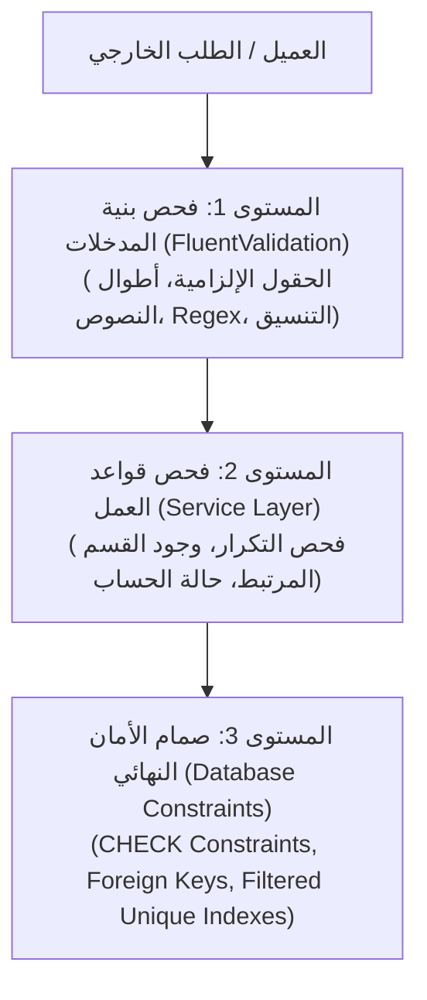

# دليل التحقق من صحة البيانات (Validation Guide)
### هرم التحقق الثلاثي: FluentValidation، منطق العمل، وقيود قاعدة البيانات

---

## 1. لماذا نحتاج إلى التحقق (Validation)؟ ولماذا لا نثق بالـ Frontend؟

القاعدة الأولى والأهم في أمن وتطوير برمجيات الـ Backend:  
> **"كل مدخلات العميل مشبوهة حتى يثبت العكس (Never Trust Client Input)."**

### لماذا لا نكتفي بالتحقق في الواجهة الأمامية (Frontend Validation)؟
1. **سهولة التجاوز:** يمكن لأي متدرب أو مستخدم تجاوز فحص الـ JavaScript في المتصفح بكل بساطة عبر إيقاف تفعيل JS أو إرسال الطلب عبر Postman أو cURL مباشرة إلى الخادم.
2. **سلامة وتماسك البيانات (Data Integrity):** وصول بيانات فاسدة أو غير منطقية (مثل بريد إلكتروني بدون `@` أو رقم هاتف تالف أو مرحلة دراسية رقم 99) يتسبب في أخطاء وقت التشغيل داخل النظام ويفسد تقارير الكلية.
3. **منع هجمات الحقن والعبث:** التحقق الصارم يمنع إدخال نصوص خبيثة أو قيم سالبة للمعرفات.

---

## 2. هرم التحقق الثلاثي في معمارية OC_System (The 3-Tier Validation Pyramid)

لا نعتمد على مكان واحد للتحقق، بل نوزع المسؤوليات على 3 مستويات محكمة:



---

## 3. تفاصيل المستويات الثلاثة وتوزيع المسؤوليات

### المستوى 1: التحقق من بنية المدخلات (Input Validation عبر FluentValidation)
- **الموقع:** داخل مجلد `Features/<Feature>/Validators/`.
- **المسؤولية:** التأكد من أن البيانات المرسلة في الـ Request Body أو Query تطابق القواعد الشكلية البسيطة دون الحاجة للاتصال بقاعدة البيانات:
  - الحقل ليس فارغاً (`NotEmpty`).
  - النص لا يتجاوز الحد الأقصى (`MaximumLength`).
  - البريد الإلكتروني يحمل صيغة بريد صحيحة (`EmailAddress`).
  - رقم الهاتف عراقي نظامي يبدأ بـ 07 (`Matches(@"^07[0-9]{9}$")`).
  - المرحلة الدراسية محصورة بين 1 و 6 (`InclusiveBetween(1, 6)`).
  - تاريخ الميلاد في الماضي وليس مستقبلياً (`LessThanOrEqualTo(DateTime.Today)`).
- **السلوك عند الفشل:** يرفض الـ Framework الطلب فوراً ويرجع **`400 Bad Request`** بقائمة الحقول الخاطئة ورسائلها، دون تشغيل الـ Controller أو الخدمة.

### المستوى 2: التحقق من قواعد العمل (Business Rules Validation في Service Layer)
- **الموقع:** داخل `Features/<Feature>/Services/<Entity>Service.cs`.
- **المسؤولية:** التحقق من القواعد المنطقية التي تتطلب قراءة من قاعدة البيانات والتأكد من سياق النظام:
  - **فحص التكرار:** هل الرقم الجامعي للطالب مسجل مسبقاً لطالب آخر فعال؟ (`IsDuplicateAsync("StudentCode", ...)`).
  - **فحص التبعية:** هل القسم الدراسي الذي يحاول الطالب التسجيل فيه موجود وفعال وغير محذوف؟ (`wrapper.Department.Get(...)`).
  - **الاستثناء أثناء التعديل:** فحص عدم التكرار مع استثناء السجل الحالي (`excludeId: id`).
- **السلوك عند الفشل:** ترجع الخدمة كائن `ServiceResult<T>.Failure(Messages.DuplicateStudentCode)` ويقوم الـ Controller بترجمتها إلى العربية وإرجاع `400 Bad Request` برسالة مفهومة.

### المستوى 3: صمام الأمان النهائي (Database Constraints & Filtered Indexes)
- **الموقع:** داخل ملفات SQL والجداول في SQL Server.
- **المسؤولية:** خط الدفاع الأخير لحماية قاعدة البيانات في حال حدوث أي خطأ برمجي غير متوقع في الـ C#:
  - `PK_Students`: المفتاح الأساسي.
  - `FK_Students_Departments`: قيد المفتاح الأجنبي مع منع الحذف العشوائي (`ON DELETE NO ACTION`).
  - `CK_Students_Stage`: قيد `CHECK (Stage BETWEEN 1 AND 6)`.
  - `CK_Students_Email`: قيد `CHECK (Email IS NULL OR Email LIKE '%_@__%.__%')`.
  - `CK_Students_BirthDate`: قيد `CHECK (BirthDate IS NULL OR BirthDate <= GETDATE())`.
  - `UQ_Students_StudentCode_Active`: فهرس فريد مصفى يمنع تكرار الرقم الجامعي بين السجلات النشطة (`WHERE IsDeleted = 0`).

---

## 4. استجابة أخطاء الـ Validation الموحدة

عند إرسال بيانات غير صالحة، يضمن النظام إرجاع رسائل دقيقة ومفصلة دون تسريب أي تفاصيل تقنية داخلية أو Stack Traces:

### مثال 1: إرسال بيانات تخالف FluentValidation (400 Bad Request)
- **الطلب:**
```json
{
  "fullName": "",
  "studentCode": "STU 101",
  "email": "invalid-email-address",
  "phoneNumber": "12345",
  "departmentId": 0,
  "stage": 9,
  "birthDate": "2030-01-01"
}
```
- **الاستجابة الفورية من الـ API (400 Bad Request):**
```json
{
  "type": "https://tools.ietf.org/html/rfc9110#section-15.5.1",
  "title": "One or more validation errors occurred.",
  "status": 400,
  "errors": {
    "FullName": ["اسم الطالب الكامل مطلوب."],
    "StudentCode": ["الرقم الجامعي يجب أن يحتوي على أحرف وأرقام ورموز صحيحة فقط."],
    "Email": ["البريد الإلكتروني المدخل غير صالح."],
    "PhoneNumber": ["رقم الهاتف يجب أن يبدأ بـ 07 ويتكون من 11 رقماً."],
    "DepartmentId": ["يجب تحديد قسم دراسي صالح للطالب."],
    "Stage": ["المرحلة الدراسية يجب أن تكون بين 1 و 6."],
    "BirthDate": ["تاريخ ميلاد الطالب يجب أن يكون في الماضي."]
  }
}
```

### مثال 2: إرسال قسم دراسي غير موجود (فحص قواعد العمل في الخدمة)
- **الاستجابة:**
```json
{
  "message": "القسم الدراسي المحدد غير موجود."
}
```

### مثال 3: إرسال رقم جامعي مكرر لطالب آخر (فحص التكرار في الخدمة)
- **الاستجابة:**
```json
{
  "message": "الرقم الجامعي للطالب مسجل مسبقاً لطالب آخر."
}
```
