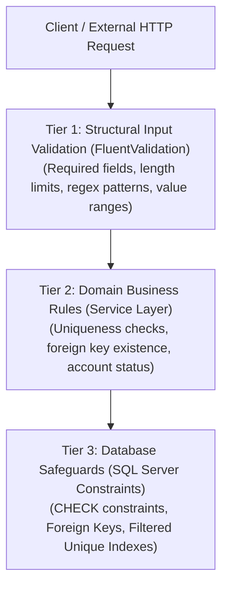

# Data Validation Architecture Guide
### The Three-Tier Validation Pyramid: Input Formatting, Domain Business Rules, and Database Constraints

---

## 1. Architectural Philosophy: Zero Trust on Input

A foundational security principle for backend architecture is:
> **"Never trust client-supplied input under any circumstances."**

### Why Frontend Validation Alone is Insufficient:
1. **Client-Side Bypassing:** Client-side JavaScript validation exists solely for user experience (immediate feedback). Any caller can bypass browser checks via direct HTTP tools (cURL, Postman, automated scripts) or by disabling client scripts.
2. **Data Consistency & Integrity:** Malformed inputs (e.g., negative identifiers, invalid dates, malformed emails) corrupt downstream business workflows and analytical reporting.
3. **Defense Against Injection & Tampering:** Robust validation sanitizes and restricts payload boundaries before inputs reach query layers or external systems.

---

## 2. The Three-Tier Validation Pyramid

The architecture divides validation responsibilities across three distinct, coordinated tiers:



---

## 3. Tier Specifications & Responsibilities

### Tier 1: Structural Input Validation (FluentValidation)
- **Location:** `Features/<Feature>/Validators/`
- **Responsibility:** Validates the structural integrity and scalar boundaries of incoming request DTOs without performing I/O or database operations:
  - Required values (`NotEmpty()`).
  - Text boundary lengths (`MaximumLength(150)`).
  - Standard format regexes (`EmailAddress()`, phone number patterns).
  - Numeric ranges (`InclusiveBetween(1, 6)` for academic stages).
  - Date validity (`LessThanOrEqualTo(DateTime.Today)` for birth dates).
- **Failure Behavior:** ASP.NET Core immediately halts pipeline execution and returns an **RFC 9110 compliant `400 Bad Request`** with a structured field-to-error dictionary. Neither the controller action nor domain services are executed.

### Tier 2: Domain Business Rules (Service Layer)
- **Location:** `Features/<Feature>/Services/<Entity>Service.cs`
- **Responsibility:** Validates contextual domain rules that require state inspection against the persistence layer:
  - **Uniqueness Validation:** Verifying that a `StudentCode` or `DepartmentCode` is not already actively assigned to another record via `IsDuplicateAsync`.
  - **Relational Existence:** Verifying that a referenced `DepartmentId` points to an active, non-deleted department before student creation.
  - **Update Isolation:** Ensuring duplicate checks exclude the current entity (`excludeId: id`) during updates.
- **Failure Behavior:** The service returns a typed `ServiceResult<T>.Failure(ErrorCode)` without throwing runtime exceptions. The `BaseController` translates this into an appropriate HTTP response (e.g., `400 Bad Request` with an localized error message).

### Tier 3: Database Constraints (Defense in Depth)
- **Location:** SQL Server Schema DDL (`Tables`, `Constraints`, `Indexes`)
- **Responsibility:** Serves as the ultimate safeguard ensuring physical data integrity even in the event of unexpected application bugs, background workers, or manual administrative scripts:
  - `PK_Students`: Clustered primary key enforcing entity uniqueness.
  - `FK_Students_Departments`: Referential integrity preventing orphaned records.
  - `CK_Students_Stage`: Hardware-level check (`Stage BETWEEN 1 AND 6`).
  - `CK_Students_Email`: Format verification check.
  - `CK_Students_BirthDate`: Temporal boundary check (`BirthDate <= GETDATE()`).
  - `UQ_Students_StudentCode_Active`: Filtered unique index enforcing code uniqueness across active records.

---

## 4. Standardized Error Response Specifications

When validation fails, the API responds with structured, deterministic error payloads:

### Scenario 1: Structural Validation Failure (FluentValidation)
- **Status:** `400 Bad Request`
- **Payload:**
```json
{
  "type": "https://tools.ietf.org/html/rfc9110#section-15.5.1",
  "title": "One or more validation errors occurred.",
  "status": 400,
  "errors": {
    "FullName": ["Full name is required."],
    "StudentCode": ["Student code must contain only valid alphanumeric characters."],
    "Email": ["The provided email address is invalid."],
    "PhoneNumber": ["Phone number must be a valid 11-digit mobile number starting with 07."],
    "DepartmentId": ["A valid department must be selected."],
    "Stage": ["Academic stage must be between 1 and 6."],
    "BirthDate": ["Birth date cannot be in the future."]
  }
}
```

### Scenario 2: Referenced Entity Not Found (Domain Rule)
- **Status:** `400 Bad Request`
- **Payload:**
```json
{
  "message": "The selected department does not exist or has been deactivated."
}
```

### Scenario 3: Duplicate Identifier Conflict (Domain Rule)
- **Status:** `400 Bad Request`
- **Payload:**
```json
{
  "message": "The student code is already in use by another active student."
}
```
