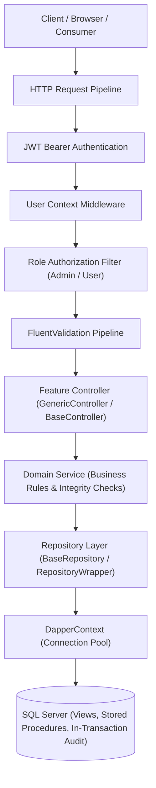

# Student Management System API

[](https://dotnet.microsoft.com/)
[](https://learn.microsoft.com/dotnet/csharp/)
[](https://www.microsoft.com/sql-server)
[](https://github.com/DapperLib/Dapper)
[](https://xunit.net/)
[](LICENSE)

An enterprise-grade RESTful API engineered for academic institution student management. Built with **.NET 10** following **Vertical Slice (Feature-Based) Architecture**, high-performance **Dapper** data access with SQL Server **Stored Procedures & Views**, **In-Transaction Atomic Audit Logging**, **JWT Authentication with Role-Based Access Control (RBAC)**, and **Sqids URL Obfuscation**.

---

## Architecture Overview

The system strictly adheres to **Vertical Slice Architecture** where domain concerns are organized into cohesive feature folders rather than fragmented technical layers.



---

## Key Architectural Principles & Highlights

1. **Vertical Slice Architecture:** Each domain module (`Auth`, `Students`, `Departments`, `AuditLogs`) encapsulates its own Controllers, DTOs, Services, Repositories, Validators, and Feature-based SQL scripts.
2. **High-Performance Stored Procedures & Views:**
   - Zero raw SQL executed from application code. All database mutations run dedicated Stored Procedures.
   - All queries read from relational views (`vw_Students`, `vw_Departments`) with soft-delete filtering (`WHERE IsDeleted = 0`).
3. **Atomic In-Transaction Audit Logging:**
   - Every `INSERT`, `UPDATE`, and `DELETE` operation atomically writes an audit entry to `AuditLogs` inside the same database transaction.
   - Guarantees complete audit traceability with zero risk of desynchronization.
4. **Three-Tier Validation Strategy:**
   - **Tier 1:** Syntactic and formatting validation via `FluentValidation`.
   - **Tier 2:** Domain logic validation in services (foreign-key verification, unique code checks).
   - **Tier 3:** Database constraints (CHECK constraints, filtered unique indexes).
5. **Role-Based Access Control (RBAC):**
   - Precise role boundaries distinguishing `Admin` and `User`.
   - Strict distinction between `401 Unauthorized` (missing or invalid token) and `403 Forbidden` (insufficient privileges).
6. **Identifier Obfuscation via Sqids:**
   - Numeric database IDs (`BIGINT`) are transparently encoded into secure, URL-safe alphanumeric strings (e.g., `b9X7mK2p`) to prevent enumeration attacks.
   - Decoded seamlessly via custom `SqidModelBinder` and `SqidJsonConverter`.
7. **Automated Dependency Injection:**
   - Scrutor assembly scanning via attributes (`[Scoped]`, `[Transient]`, `[Singleton]`), eliminating manual service registrations in `Program.cs`.
8. **Modern Interactive Documentation:**
   - Native support for both **Scalar API Reference** (`/scalar/v1`) and **Swagger UI** (`/swagger`).
9. **Rock-Solid Automated Testing:**
   - 78 comprehensive automated tests covering services, repositories, validators, helpers, and controllers using `xUnit`, `FluentAssertions`, and `Moq`.

---

## Tech Stack & Dependencies

| Category | Technology / Package | Purpose |
| :--- | :--- | :--- |
| **Runtime** | .NET 10 (C# 14) | Modern, cross-platform backend framework |
| **Data Access** | Dapper 2.1.72 | High-performance micro-ORM |
| **Database Driver** | Microsoft.Data.SqlClient 7.0.0 | Enterprise SQL Server connectivity |
| **Authentication** | Microsoft.AspNetCore.Authentication.JwtBearer 10.0.5 | Secure token-based session handling |
| **Validation** | FluentValidation.AspNetCore 11.3.0 | Strongly typed request validation rules |
| **Logging & Diagnostics** | Serilog.AspNetCore 10.0.0, Serilog.Sinks.File, Serilog.Sinks.Async | Asynchronous structured file logging partitioned by error types |
| **Cryptography** | BCrypt.Net-Next 4.1.0 | Salted password hashing |
| **DI Assembly Scanning** | Scrutor 7.0.0 | Declarative dependency injection via attributes |
| **Security / Obfuscation** | Sqids 3.2.1 | Obfuscation of internal numeric IDs in APIs |
| **API Documentation** | Scalar.AspNetCore 2.13.15 & Swashbuckle 10.1.7 | Interactive, modern API documentation |
| **Testing** | xUnit 2.9.3, FluentAssertions 7.2.0, Moq 4.20.72 | Automated unit and integration testing suite (147 tests) |

---

## Project Structure

```text
Training_Project/
├── Features/                              <-- Vertical Slice Modules
│   ├── AuditLogs/                         <-- Immutable Audit Trail Feature
│   │   ├── Controllers/                   <-- AuditLogController [Authorize(Roles = "Admin")]
│   │   ├── Dtos/                          <-- AuditLogFilter, AuditLogResponse
│   │   ├── Repositories/                  <-- IAuditLogRepository, AuditLogRepository
│   │   ├── Services/                      <-- IAuditLogService, AuditLogService
│   │   ├── Sql/                           <-- Tables, indexes, and stored procedures
│   │   └── Validators/                    <-- AuditLogFilterValidator
│   ├── Auth/                              <-- Authentication & Identity Feature
│   │   ├── Controllers/                   <-- AuthController (Login, Register)
│   │   ├── Dtos/                          <-- LoginRequest, LoginResponse, RegisterRequest, UserDto
│   │   ├── Repositories/                  <-- IUserRepository, UserRepository
│   │   ├── Services/                      <-- IAuthService, AuthService (BCrypt, JWT)
│   │   ├── Sql/                           <-- Users tables, constraints, indexes, SPs
│   │   └── Validators/                    <-- LoginRequestValidator, RegisterRequestValidator
│   ├── Departments/                       <-- Academic Departments Feature
│   │   ├── Controllers/                   <-- DepartmentController (CRUD + Lookup)
│   │   ├── Dtos/                          <-- DepartmentForm, DepartmentUpdate, DepartmentFilter, DepartmentResponse
│   │   ├── Repositories/                  <-- IDepartmentRepository, DepartmentRepository
│   │   ├── Services/                      <-- IDepartmentService, DepartmentService
│   │   ├── Sql/                           <-- Tables, views, and stored procedures
│   │   └── Validators/                    <-- DepartmentFormValidator, DepartmentUpdateValidator, DepartmentFilterValidator
│   └── Students/                          <-- Students Management Feature
│       ├── Controllers/                   <-- StudentController (CRUD)
│       ├── Dtos/                          <-- StudentForm, StudentUpdate, StudentFilter, StudentResponse
│       ├── Repositories/                  <-- IStudentRepository, StudentRepository
│       ├── Services/                      <-- IStudentService, StudentService
│       ├── Sql/                           <-- Tables, views, constraints, and stored procedures
│       └── Validators/                    <-- StudentFormValidator, StudentUpdateValidator, StudentFilterValidator
├── Infrastructure/                        <-- Shared Infrastructure, Diagnostics & Persistence
│   ├── Logging/                           <-- Structured File Logging Partitioned by Error Types
│   │   ├── AppLoggerExtensions.cs         <-- High-level typed error logger extensions
│   │   ├── ErrorClassifier.cs             <-- Automated exception & HTTP error categorizer
│   │   ├── ErrorType.cs                   <-- Enum (Database, Security, Validation, NotFound, Unhandled)
│   │   ├── LoggingOptions.cs              <-- Configurable folder, retention (30 days), size limits
│   │   └── SerilogLoggingExtensions.cs    <-- Async non-blocking file sinks per error type
│   ├── Middleware/                        <-- GlobalExceptionMiddleware, UserContextMiddleware
│   ├── Persistence/                       <-- DapperContext, DatabaseSeeder
│   │   ├── Repositories/                  <-- BaseRepository<T>, RepositoryWrapper
│   │   └── Sql/                           <-- 00_Base_Procedures.sql, 01_SeedData.sql
├── Shared/                                <-- Shared Architectural Building Blocks
│   ├── Attributes/                        <-- [Scoped], [Transient], [Singleton], [Sqid], [IgnoreParameter]
│   ├── Base/                              <-- BaseController, GenericController, IBaseService, CurrentUser
│   │   └── dto/                           <-- ServiceResult<T>, ServiceRequest<T>, Response<T>, BaseFilter
│   ├── Constants/                         <-- DbConstants, Messages
│   ├── Extensions/                        <-- ApplicationSecurityExtension, ApplicationServicesExtension, PipelineExtension
│   ├── Helper/                            <-- SqidCodec, SqidJsonConverter, SqidModelBinder
│   └── Utils/                             <-- PasswordHasher, ErrorMessagesUtils
├── sql/                                   <-- Master Database Migration Scripts
│   ├── 01_Tables.sql                      <-- Tables and constraints
│   ├── 02_Views.sql                       <-- Relational views
│   ├── 03_Procedures.sql                  <-- Stored procedures with atomic auditing
│   ├── 04_SeedData.sql                    <-- Initial seed data
│   └── MasterMigration.sql                <-- All-in-one consolidated migration script
├── tests/                                 <-- Automated Test Suite (147 Tests)
│   └── Training_Project.Tests/          <-- Strictly Organized by Feature & Layer Architecture
│       ├── Features/                      <-- Feature-by-feature test coverage
│       │   ├── AuditLogs/                 <-- Controllers, Services, Validators tests
│       │   ├── Auth/                      <-- Controllers, Services, Validators tests
│       │   ├── Departments/               <-- Controllers, Services, Validators tests
│       │   └── Students/                  <-- Controllers, Services, Validators tests
│       ├── Infrastructure/
│       │   ├── Logging/                   <-- ErrorClassifier, LoggingOptions, AppLogger, FilePartitioning tests
│       │   └── Middleware/                <-- GlobalExceptionMiddleware, UserContextMiddleware tests
│       └── Shared/
│           ├── Base/                      <-- CurrentUser, Response, ServiceResult tests
│           ├── Helper/                    <-- SqidCodec tests
│           └── Utils/                     <-- PasswordHasher, ErrorMessagesUtils tests
├── Program.cs                             <-- Minimalist, clean composition root
└── appsettings.json                       <-- Configuration settings
```

---

## Database Architecture & Setup

The database schema is organized according to the **Feature-Based SQL** pattern. You can deploy it using either method:

### Option A: All-in-One Master Script (Recommended)
Execute `sql/MasterMigration.sql` in SQL Server Management Studio (SSMS), Azure Data Studio, or via sqlcmd:

```bash
sqlcmd -S localhost -E -i sql/MasterMigration.sql
```

### Option B: Feature-by-Feature Deployment
1. `Infrastructure/Persistence/Sql/00_Base_Procedures.sql`
2. `Features/AuditLogs/Sql/01_AuditLogs_Tables_Indexes.sql` & `02_AuditLogs_Procedures.sql`
3. `Features/Auth/Sql/01_Users_Tables_Constraints_Indexes.sql` & `02_Users_Procedures.sql`
4. `Features/Departments/Sql/01_Departments_Tables_Views_Constraints_Indexes.sql` & `02_Departments_Procedures.sql`
5. `Features/Students/Sql/01_Students_Tables_Views_Constraints_Indexes.sql` & `02_Students_Procedures.sql`
6. `sql/04_SeedData.sql`

> [!NOTE]
> The application includes an automated `DatabaseSeeder.cs` that verifies and seeds administrative and standard test accounts on application startup.

---

## Configuration & Getting Started

### 1. Configuration (`appsettings.json`)
Verify database connectivity and security keys in `appsettings.json`:

```json
{
  "ConnectionStrings": {
    "DefaultConnection": "Server=localhost;Database=Training_Project_DB;Trusted_Connection=True;TrustServerCertificate=True;"
  },
  "Jwt": {
    "SecretKey": "SuperSecretKeyForStudentManagementSystem2026SecureMin32Bytes!"
  },
  "Swagger": {
    "Enabled": true
  },
  "Scalar": {
    "Enabled": true
  }
}
```

### 2. Build and Run the API
```bash
# Restore dependencies
dotnet restore

# Build project
dotnet build

# Launch API server
dotnet run --project Training_Project.csproj
```

The application will launch on `http://localhost:5207`.

---

## Interactive API Documentation

When running locally, explore the interactive documentation interfaces:

- **Scalar API Reference (Recommended):**  
  [http://localhost:5207/scalar/v1](http://localhost:5207/scalar/v1)
- **Swagger UI:**  
  [http://localhost:5207/swagger](http://localhost:5207/swagger)

Both interfaces feature full support for Bearer JWT token authorization.

---

## Authentication & Role-Based Access Control (RBAC)

### Seed User Accounts

| Role | Username | Password | Access Privileges |
| :--- | :--- | :--- | :--- |
| **Admin** | `admin` | `Admin@12345` | Full administrative control (CRUD on Departments, Student Deletion, User Registration, Audit Log viewing) |
| **User** | `user` | `User@12345` | Standard staff access (Student Read/Create/Update, Department Lookup). Deletion & Audit Logs restricted (`403 Forbidden`). |

### Endpoint Permission Matrix

| Endpoint | Method | Security Level | Required Role | Unauthorized Behavior |
| :--- | :--- | :--- | :--- | :--- |
| `/api/auth/login` | `POST` | Public | None (`[AllowAnonymous]`) | Allowed |
| `/api/auth/register` | `POST` | Protected | `Admin` | `401 Unauthorized` / `403 Forbidden` |
| `/api/department` | `GET` | Protected | Authenticated (`Admin`, `User`) | `401 Unauthorized` |
| `/api/department/lookup` | `GET` | Protected | Authenticated (`Admin`, `User`) | `401 Unauthorized` |
| `/api/department` | `POST` | Protected | `Admin` | `403 Forbidden` for standard users |
| `/api/department/{id}` | `PUT` | Protected | `Admin` | `403 Forbidden` for standard users |
| `/api/department/{id}` | `DELETE`| Protected | `Admin` | `403 Forbidden` for standard users |
| `/api/student` | `GET` | Protected | Authenticated (`Admin`, `User`) | `401 Unauthorized` |
| `/api/student/{id}` | `GET` | Protected | Authenticated (`Admin`, `User`) | `401 Unauthorized` |
| `/api/student` | `POST` | Protected | Authenticated (`Admin`, `User`) | `401 Unauthorized` |
| `/api/student/{id}` | `PUT` | Protected | Authenticated (`Admin`, `User`) | `401 Unauthorized` |
| `/api/student/{id}` | `DELETE`| Protected | `Admin` | `403 Forbidden` for standard users |
| `/api/auditlog` | `GET` | Protected | `Admin` | `403 Forbidden` for standard users |

---

## Structured File Logging Partitioned by Error Types

Located in [`Infrastructure/Logging/`](Infrastructure/Logging/), the application implements an enterprise logging architecture using **Serilog** with asynchronous, non-blocking disk I/O, daily rolling partitions, and automated exception classification into dedicated log files:

```text
Logs/
├── app-20260928.log                    <-- Global chronological log (Information and above)
└── errors/
    ├── all-errors-20260928.log         <-- Consolidated errors (Warning, Error, Fatal)
    ├── database-errors-20260928.log    <-- SQL Server, connectivity, query execution failures
    ├── security-errors-20260928.log    <-- Authentication, Authorization, JWT token violations
    ├── validation-errors-20260928.log  <-- Model validation breaches & bad request diagnostics
    └── unhandled-errors-20260928.log   <-- Unhandled runtime faults & system crashes (500)
```

### Key Engineering Practices:
1. **Separation of Concerns:** Diagnostic logging lives in `Infrastructure/Logging/`, completely independent of business feature slices.
2. **Automated Error Classification:** [`ErrorClassifier`](Infrastructure/Logging/ErrorClassifier.cs) inspects exception inheritance chains and HTTP status codes to tag log events with their specific [`ErrorType`](Infrastructure/Logging/ErrorType.cs).
3. **Asynchronous Non-Blocking I/O:** Powered by `Serilog.Sinks.Async`, ensuring file disk writes never block HTTP request threads.
4. **Automated Rolling & Retention:** Configurable via `appsettings.json` (`LoggingOptions`), defaulting to daily rolls with a 30-day retention purge policy and 10MB file limit.
5. **Developer Visibility:** High-contrast colorized console output in development, with detailed diagnostic JSON payloads returned by `GlobalExceptionMiddleware` exclusively in Development mode.
6. **Zero-Boilerplate Decorator Pattern:** [`LoggingDecorator<T>`](Infrastructure/Logging/LoggingDecorator.cs) intercepts domain service invocations dynamically via `DispatchProxy` and Scrutor (`DecorateWithLogging`), capturing execution latency, logging business failures, and routing exceptions automatically with zero logging boilerplate inside business services.

---

## Automated Testing Suite

The repository includes a comprehensive, production-grade test suite built with **xUnit**, **FluentAssertions**, and **Moq**, strictly organized file-by-file to mirror the source project's **Features and Infrastructure Architecture**. It verifies 173 distinct test cases across service business logic, authorization rules, security utilities, input validation, structured file logging sinks, logging decorators, and controller responses with 100% pure FluentValidation.

```bash
dotnet test
```

### Test Suite Summary:
```text
Passed!  - Failed: 0, Passed: 173, Skipped: 0, Total: 173, Duration: 1 s
```

- **`Features/AuditLogs/` (7 tests):** `AuditLogControllerTests`, `AuditLogServiceTests` (paged retrieval & immutability), `AuditLogFilterValidatorTests`.
- **`Features/Auth/` (15 tests):** `AuthControllerTests`, `AuthServiceTests` (login, passwords, registration, uniqueness), `LoginRequestValidatorTests`, `RegisterRequestValidatorTests`.
- **`Features/Departments/` (22 tests):** `DepartmentControllerTests`, `DepartmentServiceTests` (CRUD, lookup, code uniqueness), `DepartmentFormValidatorTests`, `DepartmentUpdateValidatorTests`, `DepartmentFilterValidatorTests`.
- **`Features/Students/` (24 tests):** `StudentControllerTests`, `StudentServiceTests` (CRUD, duplicate student code, department verification), `StudentFormValidatorTests`, `StudentUpdateValidatorTests`, `StudentFilterValidatorTests`.
- **`Infrastructure/Logging/` (26 tests):** `LoggingDecoratorTests` (5 tests), `ErrorClassifierTests` (13 tests), `LoggingOptionsTests` (2 tests), `AppLoggerExtensionsTests` (4 tests), `SerilogFilePartitioningTests` (physical multi-sink file routing verification).
- **`Infrastructure/Middleware/` (6 tests):** `GlobalExceptionMiddlewareTests` (Dev vs Prod, errorType assertions), `UserContextMiddlewareTests` (UserId claim validation, 401 unauthorized handling).
- **`Shared/` (52 tests):** `CurrentUserTests`, `ResponseTests`, `ServiceResultTests`, `SqidCodecTests`, `PasswordHasherTests`, `ErrorMessagesUtilsTests`.

---

## Architectural Documentation

Detailed architectural and design guides are available in the [`Documentation/`](Documentation/) directory:

| Guide | Description |
| :--- | :--- |
| [`Architecture-Guide.md`](Documentation/Architecture-Guide.md) | Vertical Slice design, HTTP pipeline flow, and Scrutor Auto-DI architecture. |
| [`Security-Flow-Guide.md`](Documentation/Security-Flow-Guide.md) | End-to-end security lifecycle, JWT Bearer verification, and `UserContextMiddleware`. |
| [`Authentication-Guide.md`](Documentation/Authentication-Guide.md) | Authentication mechanics, BCrypt password hashing, session tokens, and claims structure. |
| [`Authorization-Guide.md`](Documentation/Authorization-Guide.md) | RBAC security model, 401 vs 403 handling, and endpoint protection policies. |
| [`Audit-Log-Guide.md`](Documentation/Audit-Log-Guide.md) | Atomic in-transaction audit logging, append-only immutability, and audit actions matrix. |
| [`Database-Guide.md`](Documentation/Database-Guide.md) | Database-first schema design, relational views, filtered indexes, and Stored Procedures. |
| [`Validation-Guide.md`](Documentation/Validation-Guide.md) | Multi-tier defense-in-depth validation strategy (FluentValidation -> Service -> DB). |
| [`API-Testing-Guide.md`](Documentation/API-Testing-Guide.md) | Practical API testing reference, sample payloads, error responses, and test suite guide. |
| [`Base-Files-Guide.md`](Documentation/Base-Files-Guide.md) | Architectural reference for reusable core components and design patterns. |
